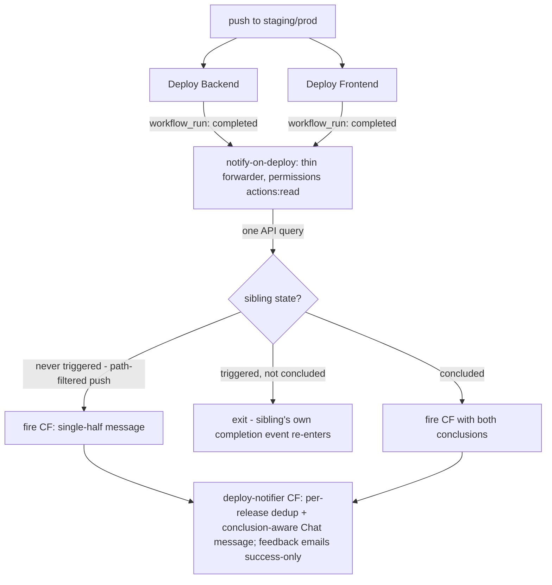

# Tempo Package — CI, Deploy, and Tooling Overhead Fixes - Plan

**Target repos:** this plan spans three repos plus per-machine config. Each implementation unit names its target. Repo-relative paths are relative to the unit's target repo.

- `blueprintos` (GitHub: Blueprint-Inc/BlueprintOS, integration branch `staging`)
- `styleblueprint-audience-warehouse` (default branch `main`)
- `blueprint-claude-kit` (this repo, default branch `main`)

---

## Goal Capsule

- **Objective:** Repair the two dead warehouse workflows and remove the measured CI/deploy/tooling overhead identified in the 2026-07-08 tempo audit, saving ~22–25 h/month of CI wall-clock and ~45–90 min/day of team tempo.
- **Authority:** This plan's Product Contract governs scope. The 2026-07-08 audit data (run counts, durations, usage measurements) is the factual basis; re-verify a number only if implementation contradicts it.
- **Stop conditions:** Stop and surface rather than guess if (a) the pytest suite fails under parallelization for state-bleed reasons that aren't quickly isolable, (b) the notification consolidation would change what messages Google Chat receives (not just when), or (c) any change requires touching the deploy scripts' server-side behavior.
- **Execution profile:** Each unit lands as its own PR to the target repo's integration branch (`staging` for blueprintos, `main` for the others). Units are independent unless a dependency is named; land U1/U2 first, and U6 before U5 (both rewrite the Frontend Checks job in `ci-checks.yml`, and U5's gating targets the jobs U6 creates).
- **Tail ownership:** After merge, each CI unit is verified per the Verification Contract table — several gates require two observed runs — before its DoD line is checked.

---

## Product Contract

### Summary

The 2026-07-08 setup review measured where development tempo goes: two warehouse workflows fail on 100% of runs (one silently staling a BigQuery table), blueprintos deploys spend up to ~108s polling for a sibling workflow, a redundant full CI suite runs on every staging→prod release PR, the warehouse test suite runs single-process, and dev machines carry MCP servers and instruction mandates with zero-to-trivial measured use. This plan fixes the broken pieces and removes the measured waste. It follows the same evidence rule that drove the GitNexus removal: every change here is justified by run counts, durations, or transcript usage data, not taste.

### Problem Frame

CI volume is high (≈602 deploys and ≈519 PR CI runs per month across the two product repos), so per-run seconds compound into hours. Separately, always-on machine config (MCP servers, instruction mandates) costs every Claude Code session context weight and startup time regardless of whether the tool is used. Both classes of waste were measured on 2026-07-08; the numbers are in each unit.

### Requirements

**Repair (broken today)**

- R1. `sync-team-members` (warehouse) succeeds on its daily schedule and on dispatch, so `audience_warehouse.saw_team_members` is refreshed daily. Root cause: the workflow installs nonexistent PyPI package `cloud-sql-connector`; the real package is `cloud-sql-python-connector`.
- R2. `notify-on-deploy` (warehouse) parses as valid YAML, registers its `workflow_run` trigger, produces zero startup-failure runs on push, and fires the deploy-notifier CF after a successful `reconcile` on `main`. Root cause: the `run:` step is an unquoted flow scalar containing `Content-Type: application/json` — the interior `: ` makes the file invalid YAML ("mapping values are not allowed here", line 30), so GitHub rejects it on every push and the trigger never registers.

**CI/deploy speed**

- R3. blueprintos deploy workflows no longer block on `gh run list` polling for their sibling; all deploy notifications — combined success, failure variants, single-sided deploys, and the staging release-PR message — are still delivered exactly once each via the event-driven path, with the same content. Target: prod deploy job wall-clock ~145s → ~40s.
- R4. The auto-generated staging→prod release PR drops the duplicate frontend build; backend phpunit and the split `frontend-test` job are retained as the final merged-state gates (they run in parallel, so the ~55s release-PR CI target holds).
- R5. Frontend CI caches the Playwright Chromium download (~24s/run) and runs `npm run test` and `npm run build:staging` as parallel jobs. Target: frontend CI ~138s → ~95s.
- R6. Warehouse pytest runs parallelized (`pytest-xdist`) with coverage moved off the per-PR hot path. Target: tests job ~123s → ~60–70s, applying to both `pr-tests` and the tests gate inside `reconcile`.

**Machine/tooling overhead**

- R7. Dev machines drop the four zero-to-trivial-use MCP servers (context7, google-dev-knowledge, google-sheets, gsc), the qmd MCP server, and the stale `n8n-mcp` registration; stale project entries are pruned from `~/.claude.json`. All removals archived, not destroyed.
- R8. The global `CLAUDE.md` "always use qmd first" mandate is removed (qmd CLI stays documented as an available tool); the workspace `CLAUDE.md` Workflow Orchestration and Task Management sections are condensed to a short principles list, with workflow ownership pointed at Compound Engineering.
- R9. `docs/claude-setup-baseline.md` in blueprint-claude-kit records every machine-side change with its evidence, so the other two dev machines can replicate it.

### Scope Boundaries

**Deferred to Follow-Up Work**

- `actionlint` (or equivalent) as a CI gate on workflow files — would prevent the R2 bug class repo-wide; worth doing, separate PR.
- `uv` for dependency install in warehouse workflows (~10–15s/run; pip caching already works).
- Hiding the ~15 unused CE plugin skills via `skillOverrides` — cosmetic token trim, needs per-machine settings replication.
- RTK / Context Mode trials — governed by `docs/rtk-trial-protocol.md`, not this plan.

**Outside this plan's identity**

- The warehouse CF deploy architecture (already parallel and delta-based; audit confirmed not a bottleneck).
- blueprintos' build-on-target-VM deploy model (server-side `npm ci` + `vite build` ~118s is intrinsic to that model).
- Coach-lessons pipeline changes (landed separately on 2026-07-08).

---

## Planning Contract

### Key Technical Decisions

- **KTD1 — Fix `notify-on-deploy`, don't delete it.** The deploy-notifier CF was deliberately built (warehouse `docs/plans/2026-06-17-001-feat-deploy-notification-agent-plan.md`) with webhook-secret validation and SendGrid/Chat delivery; the workflow is dead by YAML accident, not by decision. Flip to deletion only if the team confirms the notifications are unwanted.
- **KTD2 — Release PRs keep both test suites, drop only the frontend build.** The release PR is the only run that tests the merged staging state — for the frontend as much as the backend (`ci-checks.yml` runs only on `pull_request`; there is no push-to-staging CI). So keep phpunit and `frontend-test` (they run in parallel; ~55s wall-clock either way) and gate off only `frontend-build` (~43s), whose signal the deploy's own build + health check duplicates. This makes U6's job split a prerequisite of U5.
- **KTD3 — Condense the workspace CLAUDE.md ceremony, don't delete it.** Verification-before-done, root-cause discipline, and simplicity-first stay visible as principles; the plan-mode/todo.md/subagent choreography goes, because Compound Engineering skills own workflow now (400+ measured invocations).
- **KTD4 — Block scalars for any workflow `run:` containing a colon-space.** The R2 fix converts the offending step to `run: |` block form (matching the working blueprintos sibling) rather than quote-escaping — block scalars are immune to this class and easier to read.
- **KTD5 — Notification consolidation: thin `workflow_run` forwarder, CF as single poster.** blueprintos already has `notify-on-deploy.yml` triggered by `workflow_run` on both deploy workflows, and the deploy-notifier CF already carries per-release "already notified" dedup (the workflow's own comments document it being called up to twice per release). So: the polling steps in `deploy-app.yml`/`deploy-web.yml` are deleted; the workflow becomes a thin, least-privilege forwarder; and the CF becomes the single poster of the combined Chat message — its existing dedup is what guarantees exactly-once, since near-simultaneous sibling completions produce two `workflow_run` events and no GitHub Actions primitive dedups them (concurrency groups queue, they don't dedup). Event-driven replaces polling; the documented `gh run list` propagation race disappears with the code that worked around it.
- **KTD6 — xdist adoption is gated on a local shared-state validation.** `pytest -n auto` runs locally against the full suite before any workflow change lands. If isolated failures appear, fix or mark them; if state-bleed is structural, stop and surface (Goal Capsule stop condition).

### High-Level Technical Design

Target notification topology for blueprintos (R3) — polling removed, one event-driven notifier:

The sibling check reads the sibling's conclusion via the GitHub API at event time (one query, no polling loop) and distinguishes "never triggered for this head SHA" (single-sided, path-filtered push) from "not yet concluded". The CF composes and posts every Chat variant — combined success, failure titles, single-half, staging release-PR — and its existing per-release dedup guarantees exactly-once. Each deploy workflow ends when its deploy and health check end.

### Assumptions

- The deploy-notifier CF and its `DEPLOY_NOTIFIER_*` secrets are already provisioned in both repos (verified for warehouse via workflow comments; blueprintos already fires the CF successfully).
- Warehouse test suite is mock-heavy with no order-dependent tests (audit finding; validated by KTD6 before landing).
- MCP usage counts from 459 transcripts on one machine generalize to the other two dev machines; the baseline doc instructs each dev to re-check with the same grep before removing.

---

## Implementation Units

### U1. Fix sync-team-members package name and add pip cache

- **Goal:** The daily team-members sync succeeds, refreshing `saw_team_members`.
- **Requirements:** R1
- **Target repo:** styleblueprint-audience-warehouse
- **Files:** `.github/workflows/sync-team-members.yml`
- **Approach:** Rename `cloud-sql-connector[pymysql]` → `cloud-sql-python-connector[pymysql]` in the inline `pip install` (line ~45); add `cache: pip` to the `setup-python` step to match the repo's other workflows.
- **Patterns to follow:** `setup-python` + `cache: pip` shape in `.github/workflows/test.yml`.
- **Test scenarios:**
  - Happy path: `gh workflow run sync-team-members` completes green; `saw_team_members` shows a fresh sync timestamp.
  - Failure path: confirm the job still fails loudly (non-zero) if `BOS_DB_PASSWORD` is absent — the fix must not mask auth errors.
- **Verification:** One green dispatch run, then one green scheduled run; BigQuery table freshness confirmed via a `MAX(updated_at)`-style query.

### U2. Fix notify-on-deploy YAML parse failure

- **Goal:** The workflow file parses, the `workflow_run` trigger registers, and the deploy-notifier CF fires after successful reconciles.
- **Requirements:** R2
- **Target repo:** styleblueprint-audience-warehouse
- **Files:** `.github/workflows/notify-on-deploy.yml`
- **Approach:** Convert the single `run:` flow scalar (the curl with `-H "Content-Type: application/json"`) to a `run: |` block scalar per KTD4. No behavioral change to the curl itself.
- **Patterns to follow:** blueprintos `.github/workflows/notify-on-deploy.yml` (the working sibling, 72 successful runs/month).
- **Test scenarios:**
  - Parse gate: the file loads under a YAML parser locally before pushing (this exact failure is reproducible with any YAML lib).
  - Happy path: first push after merge produces no startup-failure run named by file path.
  - Integration: next successful `reconcile` on `main` triggers the workflow; CF logs show the webhook accepted (X-Webhook-Secret validated — see kit lesson `cf-deploy-notifier-endpoint-validates-webhook-secret`).
  - Negative path: a failed reconcile does not fire the CF (`if: conclusion == 'success'` retained).
- **Verification:** Zero startup-failure runs across three consecutive pushes; one observed CF firing with delivery.

### U3. Parallelize warehouse pytest and move coverage off the PR path

- **Goal:** Tests job ~123s → ~60–70s for every PR and reconcile run.
- **Requirements:** R6
- **Target repo:** styleblueprint-audience-warehouse
- **Files:** `requirements-dev.txt`, `.github/workflows/test.yml`; possibly `pytest.ini` (xdist-incompatible test markers if any surface)
- **Approach:** Add `pytest-xdist`; change the pytest step to `-n auto`; remove `--cov` flags from the per-PR invocation, and remove (or relocate with coverage) the dependent Coverage summary step in `test.yml` — it runs `coverage report` and fails when no coverage data file exists. Coverage either moves to a small nightly job or is dropped (it is report-only today, no threshold gate) — implementer's call, note the choice in the PR.
- **Execution note:** Run the full suite locally with `-n auto` first (KTD6). Land the workflow change only after a clean or cleanly-fixed local parallel run.
- **Test scenarios:**
  - Happy path: full suite green under `-n auto` locally and in CI with the same pass count as serial (±0 tests).
  - Edge: repeat the parallel run twice locally to catch order-dependent flakiness before CI does.
  - Failure path: a genuinely failing test still fails the job under xdist (inject one temporarily to confirm signal isn't swallowed).
- **Verification:** Two consecutive green `pr-tests` runs at ≤80s job time; `reconcile`'s tests gate shows the same improvement.

### U4. Consolidate blueprintos deploy notifications (kill the polling)

- **Goal:** Deploy jobs end when deployment ends; every deploy notification — combined success, failure variants, single-sided, and the staging release-PR message — arrives via the event-driven path exactly once.
- **Requirements:** R3
- **Target repo:** blueprintos
- **Files:** `.github/workflows/deploy-app.yml`, `.github/workflows/deploy-web.yml`, `.github/workflows/notify-on-deploy.yml`; the deploy-notifier CF source (message composition moves there)
- **Approach:** Delete the sibling-wait/notify polling steps from both deploy workflows — on the prod path AND the staging path: the staging "Notify DevOps — PR ready for release" step is itself a `gh run list` polling block, so its replacement is committed scope, not an implementation-time option. Release-PR *creation* stays in `deploy-app.yml`. Rework `notify-on-deploy.yml` into a thin, least-privilege forwarder per KTD5: trigger extended to staging alongside prod; a `permissions:` block granting only `actions: read`; every `workflow_run` event-derived value (head commit message, actor, branch, PR text) passed into `run:` steps via `env:` indirection, never inline `${{ }}` interpolation — the default `GITHUB_TOKEN` is write-all in this repo, and inline interpolation of commit text into shell is a script-injection path (the existing CF-firing step's `env:` shape is the pattern). Remove the job-level `if: conclusion == 'success'` gate — the forwarder fires the CF on every terminal conclusion. The CF becomes the single poster: conclusion-aware Chat titles reproducing the current in-job variants (Deploy Succeeded / Succeeded backend-only / Backend Deploy Succeeded — Frontend status unknown / Deploy Failed), single-half messages for path-filtered single-sided deploys, the staging release-PR message with PR number/title re-derived via `gh pr list --base prod --head staging` (a `workflow_run` event carries no step outputs), and per-release dedup guaranteeing exactly-once. Feedback emails remain success-only.
- **Execution note:** `workflow_run` workflows execute the default-branch (**prod**) file version, so the notifier rework is dormant until the release that ships U4 merges to prod — while the polling-step deletions take effect on staging immediately. Keep the staging in-job notify steps in place until that release lands (delete them in the release itself, or accept a one-cycle staging-notification gap — team's call at PR time). Add a `workflow_dispatch` input accepting a past run ID so the forwarder's sibling-conclusion logic can be rehearsed before the release, and run the R3 verification on the release that ships U4 itself.
- **Patterns to follow:** The existing `workflow_run` + webhook-secret pattern and the CF-firing step's `env:` indirection in `notify-on-deploy.yml`.
- **Test scenarios:**
  - Happy path (prod): both deploys green → exactly one combined Chat message; title and content match the current format.
  - Ordering: backend finishes first vs. frontend finishes first — one message either way; near-simultaneous completion exercises the CF's dedup path.
  - Failure path: one deploy fails → the matching failure-variant message is delivered (no false "both succeeded"), and no feedback emails send.
  - Single-sided: a push touching only `app/**` runs only Deploy Backend → single-half message matching current behavior; the forwarder distinguishes "sibling never triggered for this head SHA" from "sibling not yet concluded".
  - Staging: one staging push → release-PR message delivered exactly once with correct PR number and title.
  - Rehearsal: `workflow_dispatch` with a past run ID exercises the forwarder end-to-end before the release.
- **Verification:** One observed prod release with all messages correct and Deploy Backend job wall-clock ≤60s (from ~145s); one observed staging push with the release-PR message via the event-driven path; the `gh run list` race-workaround comments are gone.

### U5. Slim CI on staging→prod release PRs

- **Goal:** Release PRs stop re-running the duplicate frontend build; backend tests and `frontend-test` remain the final merged-state gates.
- **Requirements:** R4
- **Dependencies:** U6 (the `frontend-test`/`frontend-build` split must exist before this gating can target it)
- **Target repo:** blueprintos
- **Files:** `.github/workflows/ci-checks.yml`
- **Approach:** Gate the `frontend-build` job off for PRs where head is `staging` and base is `prod` (the auto-generated release PR); Backend Checks and `frontend-test` continue to run per KTD2 — they run in parallel, so retaining `frontend-test` costs ~zero wall-clock against the target. Implement as a job-level `if:` on `github.head_ref`/`github.base_ref` composed with the existing `dorny/paths-filter` conditions.
- **Test scenarios:**
  - Happy path: a release PR runs Backend Checks + `frontend-test` but not `frontend-build`; a normal feature PR to staging runs the full conditional set unchanged.
  - Edge: a manually-opened staging→prod PR behaves the same as the bot's (the condition keys on branches, not author — simpler and safer).
- **Verification:** Next staging→prod cycle shows the release-PR CI run at ~55–60s (backend + parallel frontend-test) instead of ~148s.

### U6. Cache Playwright and parallelize frontend test/build

- **Goal:** Frontend CI ~138s → ~95s.
- **Requirements:** R5
- **Target repo:** blueprintos
- **Files:** `.github/workflows/ci-checks.yml`
- **Approach:** Add `actions/cache` for `~/.cache/ms-playwright` keyed on `hashFiles('web/package-lock.json')`, skipping the browser download on hit. Split the Frontend Checks job into two parallel jobs (`frontend-test`, `frontend-build`), both `needs: changes` and sharing the npm cache; critical path becomes max(54s, 43s) instead of 97s.
- **Test scenarios:**
  - Cache miss path: first run post-merge installs Chromium and populates the cache; job still green.
  - Cache hit path: second run skips the download (~24s saved, visible in step timing).
  - Split integrity: a failing test fails `frontend-test` without being masked by a green build, and vice versa.
- **Verification:** Two consecutive frontend-touching PRs with total frontend CI wall-clock ≤100s.

### U7. Machine tooling cuts, CLAUDE.md trims, and kit documentation

- **Goal:** Dev machines stop paying for tooling with zero measured use; the changes are documented and replicable.
- **Requirements:** R7, R8, R9
- **Target repo:** blueprint-claude-kit (docs); per-machine config outside any repo (`~/.claude.json`, `~/.claude/CLAUDE.md`, workspace `CLAUDE.md`)
- **Files:** `docs/claude-setup-baseline.md` (kit); machine-side: `~/.claude.json`, `~/.claude/CLAUDE.md`, `~/Projects/CLAUDE.md`, `~/.claude/rules/context7.md` (the standing "always use Context7 MCP" mandate — removing the server without this file leaves every session ordering calls to a nonexistent server; already archived on jaygraves' machine 2026-07-08, must be named in the baseline doc so the other two machines remove the pair together)
- **Approach:** Remove MCP registrations per R7 (archive the JSON blocks into the existing `~/.claude/backups/setup-review-20260708/` pattern first); prune the five stale `~/.claude.json` project entries; apply the R8 CLAUDE.md edits per KTD3 (qmd mandate → one-line tool mention; ceremony sections → short principles list naming CE as workflow owner). Update the baseline doc with a "Round 2" section: what was removed, the usage evidence (0–2 calls per removed server; qmd ~50 uses vs. an "always" mandate), and the re-check grep for the other two devs to run before applying.
- **Test scenarios:** Test expectation: none — config and documentation changes; verification is behavioral.
- **Verification:** A fresh Claude Code session in `~/Projects` starts without the removed servers (`claude mcp list` clean), context overhead measurably drops (`/context`), qmd CLI still works on demand, and the baseline doc renders the round-2 section with the evidence table.

---

## Verification Contract

| Gate | Command / signal | Applies to |
|---|---|---|
| Warehouse suite green, parallel | `venv/bin/pytest tests/ -n auto` locally, then green `pr-tests` | U3 |
| Warehouse workflow health | `gh run list --workflow <name> --limit 3` — all green, no startup failures | U1, U2 |
| Table freshness | BigQuery: `saw_team_members` max timestamp within 24h after one scheduled run | U1 |
| CF firing | Deploy-notifier CF logs show accepted webhook after a green `reconcile` | U2 |
| blueprintos CI green | Feature PR + release PR runs behave per U5/U6 expectations | U4–U6 |
| Deploy timing | `gh run list` durations: prod Deploy Backend ≤60s; frontend CI ≤100s; release-PR CI ≤70s | U4–U6 |
| Notification parity | One observed prod release: combined Chat message + CF email delivery, exactly once; plus one observed staging push with the release-PR message via the event-driven path | U4 |
| Machine config | `claude mcp list` shows only qmd-free retained set; `/context` overhead reduced; backups present | U7 |

PHP tests (`cd app && ./vendor/bin/phpunit tests/`) and the frontend build must stay green throughout — no blueprintos unit changes application code, so any product-test failure is a regression signal, not an expected cost.

## Definition of Done

- [ ] R1–R2: three consecutive days with `sync-team-members` and zero notify-on-deploy startup failures; one verified CF delivery
- [ ] R3: one observed prod release with consolidated notifications (success variant, exactly once) and deploy job ≤60s, plus one staging push with the release-PR message via the event-driven path
- [ ] R4–R5: release-PR and frontend CI timings at target on real runs
- [ ] R6: warehouse PR feedback ≤80s on two consecutive PRs
- [ ] R7–R8: machine changes applied on jaygraves' machine, archived, reversible
- [ ] R9: baseline doc round-2 section merged; other two devs have the replication instructions
- [ ] No abandoned experiments: temporary test injections (U3) and any trial workflow runs cleaned up
- [ ] Each landed unit's PR references this plan
