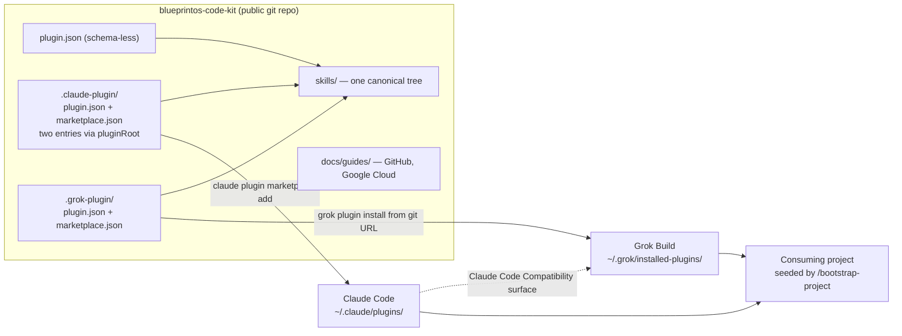
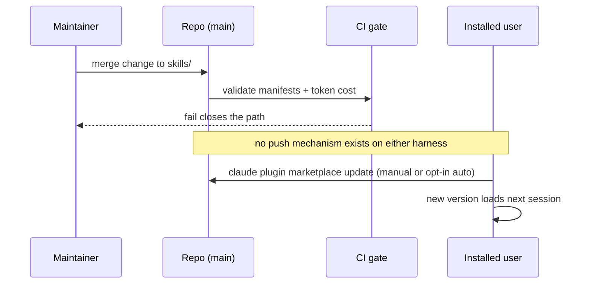
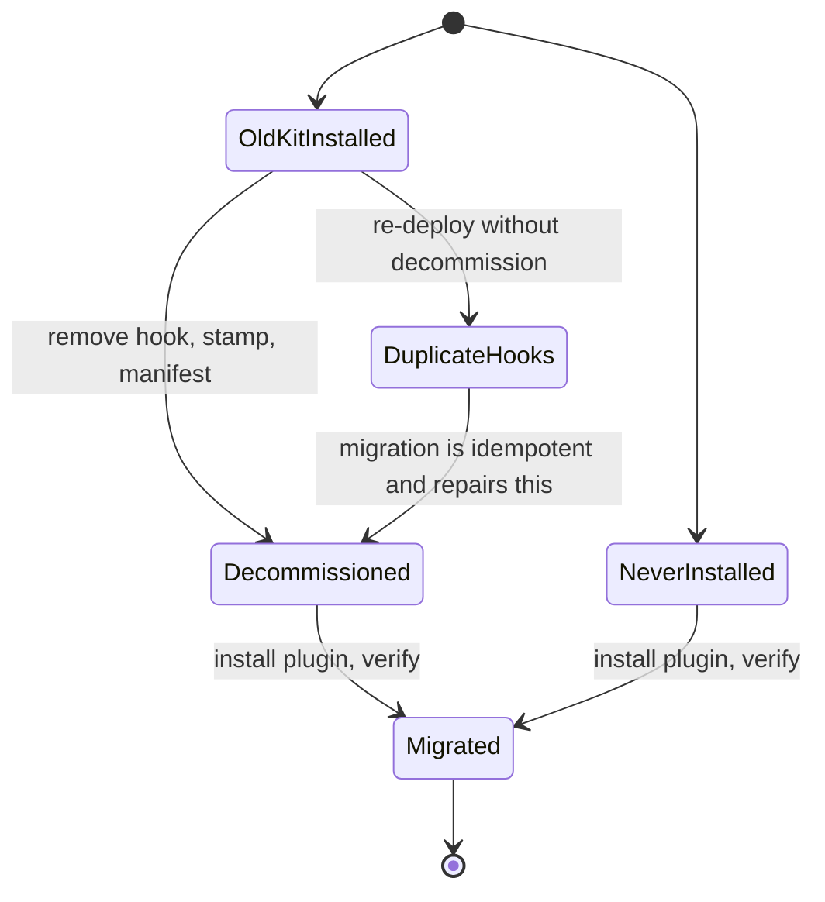

# BlueprintOS Code Kit Re-Founding - Plan

## Goal Capsule

- **Objective:** A developer starting from a blank machine — inside or outside Blueprint — reaches a working Compound Engineering session on the harness of their choice by following this repository alone. A Blueprint developer running both Claude Code and Grok Build against one checkout sees the same workflows in both, without maintaining two copies.
- **Means:** Rename the repository to `blueprintos-code-kit`; repackage the kit as a git-installable plugin with one canonical skills tree and per-harness adapters; split a generic core from a Blueprint overlay; reconcile the documented baseline against what the installer actually does; make the setup guides the repository's entry point.
- **Authority:** This Product Contract governs scope. The audit findings recorded in Sources / Research were verified against the filesystem on 2026-09-19; re-verify a finding only if implementation contradicts it.
- **Open blockers:** None. The four mechanics deferred from the brainstorm are settled as Key Technical Decisions; one measurement remains open before the per-project step ships, named in Outstanding Questions.
- **Not active scope:** Azure and AWS setup guides. See How This Work Fits Together.

---

## Product Contract

### Summary

Re-found the kit as `blueprintos-code-kit`: an onboarding path from a blank machine to a working Compound Engineering workflow, whose commands and skills ship as a git-installable plugin reaching both Claude Code and Grok Build from one canonical source. The repository holds two packages — a generic core anyone can adopt, and a Blueprint overlay carrying org conventions.

### Problem Frame

The kit's current model is a deploy script that copies configuration into each project. That model is not holding. Of the repositories under the team's projects directory, exactly one has the kit installed, stamped `2026.05.29` against a current `2026.08.23`. Every piece of machinery that makes the copy model survivable — the sha256 manifest, orphan detection, version stamping, the SessionStart upgrade nag — exists because copies go stale, and they went stale anyway.

The documentation has drifted from the tooling underneath it. `docs/claude-setup-baseline.md` records a measured 2026-07-08 audit that turned off `superpowers`, `pr-review-toolkit`, and `ralph-wiggum` and removed GitNexus and the qmd MCP server. `setup.sh` still installs all five. A newcomer running the documented setup today lands on precisely the configuration the audit removed, and `deploy.sh` still launches GitNexus indexing against their project. Three documents hold three different positions on `frontend-design` alone.

A second harness arrived without the kit noticing. Grok Build reads project skills only from `.grok/skills/` and has no project-commands concept at all, so the eight workflows in `.claude/commands/` — the entire issue-driven loop — are structurally invisible there. The team's response has been to hand-roll skills per repository, which is the drift the kit exists to prevent.

The cost lands hardest on the person the kit is now for. A beginner following this repository does not get a working environment; they get a stale one, and no way to tell.

### Key Decisions

- **The repository's product is the onboarding path, not the payload.** Installable workflows ride along; the setup guides and install path are the headline. *(session-settled: user-directed — chosen over plugin-packaging-with-current-framing and over a harness-neutral deploy script: the deciding criterion is whether a beginner succeeds, and the copy model is what produced one-of-eight adoption at three versions stale.)* Governs R10, R11, R15.
- **Machine-level install replaces per-project copies.** *(session-settled: user-directed — chosen over copying files into every project: beginner success over config visibility in the consuming repo.)* Governs R3, R4.
- **One canonical skills tree with per-harness adapters, following the Compound Engineering plugin's own layout.** *(session-settled: user-approved — chosen over writing parallel trees per harness: the primary dependency already proves the pattern, and a single source makes divergence structurally impossible rather than merely discouraged.)* Governs R1, R2.
- **Generic core plus opt-in Blueprint overlay.** *(session-settled: user-directed — chosen over a single Blueprint-defaulted kit with documented escape hatches, and over stripping Blueprint specifics entirely: beginners outside the company are a real target user, and the org's conventions are real too.)* Governs R6, R7, R8, R9.
- **One repository named `blueprintos-code-kit` holds both packages.** *(session-settled: user-directed — chosen over a generic repository name with a `blueprintos-*` overlay package, and over splitting into two repositories: simplest to operate, accepting that outsiders installing the core see the product name on it.)* Governs R22.
- **Both the cross-model deep-review skill and the cloud deploy skill go in the overlay.** *(session-settled: user-directed — chosen over fixing deep review's portability in place, over a third package, and over cutting it: it invokes another plugin's skill and agents by name, a runtime dependency no manifest can declare, so a core installed without Compound Engineering would ship a skill that silently fails.)* Governs R8.
- **Workflows currently shaped as commands become skills.** Grok Build has no project-scoped commands concept, and a skill carries the description that lets either harness surface and invoke it. Governs R2.

<!-- ce-section: work-relationships -->
### How This Work Fits Together

This plan covers the re-founding: rename, packaging, the core/overlay split, drift reconciliation, and the GitHub and Google Cloud setup guides. The breakdown below is the current understanding of the surrounding work, not a committed roadmap.

- Microsoft Azure setup guide
  - Depends on the guide structure established by R12–R14 here.
  - Can proceed independently of everything else in this plan once that structure exists.
- Amazon Web Services setup guide
  - Depends on the same guide structure.
  - Shares its shape with the Azure guide; the two are likely one later piece of work rather than two.
- Developer-machine hygiene beyond this repository
  - Can proceed independently of this plan.
  - Still to decide: whether the kit should have an opinion about machine state it does not install, such as accumulated global skills or credentials held in harness configuration files.

### Actors

- A1. **Beginner** — new to the framework, inside or outside Blueprint, starting from a machine with little or nothing installed. The primary actor.
- A2. **Blueprint developer** — runs both Claude Code and Grok Build against the same checkout, sometimes on the same day.
- A3. **Kit maintainer** — changes a workflow and needs the change to reach both harnesses without a second edit.
- A4. **Claude Code** and **Grok Build** — the two harnesses, each with its own discovery rules for instructions, skills, and plugins.

### Requirements

**Packaging and harness reach**

- R1. The kit's skills exist in exactly one canonical directory in the repository, with each harness's expected location resolving to that directory, so a skill cannot differ between harnesses.
- R2. Every user-invocable workflow the kit ships is discoverable in both Claude Code and Grok Build from a single install.
- R3. The kit installs at machine level directly from this git repository on both harnesses, with no per-project copy step required to obtain the workflows.
- R4. Content placed in a consuming repository is limited to what is genuinely per-project: project instructions, review-agent configuration, and issue scopes.
- R5. Project instruction files stay within each harness's discovery limits, including Grok Build's 10,000-character cap per rules file.

**Core and overlay**

- R6. The repository ships two installable packages: a generic core and a Blueprint overlay.
- R7. The core assumes nothing about Blueprint's organization, repositories, branch conventions, directory layout, or cloud accounts.
- R8. The overlay carries the Blueprint-specific behavior currently embedded in shared files, including the `blueprintos` → `staging` base-branch rule, the cloud-function deploy skill, the cross-model deep-review skill, and Blueprint issue scopes.
- R9. Installing the core alone yields a working workflow; the overlay is additive and never required.

**Onboarding path**

- R10. The repository's entry point is an ordered path from a blank machine to a verified working session.
- R11. The path states which harness the reader is setting up and never requires them to set up both.
- R12. The repository carries a publicly usable GitHub setup guide covering account setup, CLI authentication, and the repository conventions the workflows depend on.
- R13. The repository carries a publicly usable Google Cloud setup guide covering project creation, billing, CLI authentication, and the minimum services the kit's workflows touch.
- R14. The two guides share a structure that accommodates additional cloud providers later without restructuring the existing guides.
- R15. The path ends in a verification step the reader runs themselves, whose output distinguishes a working install from a partial one.

**Drift reconciliation**

- R16. The prerequisites installer and the documented plugin baseline state one plugin set, and that set is the one the 2026-07-08 audit concluded with.
- R17. Each plugin the kit has an opinion about has exactly one stated position across the installer, the baseline document, and the skill map.
- R18. No kit-installed tooling references GitNexus or the qmd MCP server.
- R19. The canonical skill map lists only skills the baseline leaves enabled.
- R20. The repository carries a LICENSE.
- R21. References with nothing behind them are removed, including the ignore entry for a generated instructions file that nothing generates, and setup instructions for repositories and servers no longer in use.

**Rename and migration**

- R22. The repository, its remote, and every in-repository reference use the name `blueprintos-code-kit`.
- R23. The existing deployment in the `blueprintos` repository is retired rather than left pointing at a path that no longer exists, including its version stamp, manifest, and session-start hook.
- R24. Machine-level references to the old path are enumerated in a migration step, including permission rules held in the user's harness settings.
- R25. Someone who installed the previous kit has a documented path from that state to the new one that does not require them to diagnose what the old installer left behind.

### Key Flows

- F1. Blank machine to first working session
  - **Trigger:** A1 opens the repository with nothing installed.
  - **Actors:** A1, A4
  - **Steps:** Reader picks a harness; installs prerequisites and that harness; installs the core from this repository; runs the verification step; sees a named result confirming the workflows are discoverable.
  - **Outcome:** A working session with the kit's workflows available, reached without asking anyone.
  - **Covered by:** R3, R10, R11, R15

- F2. Blueprint developer adds the overlay
  - **Trigger:** A2 has the core working and needs org conventions.
  - **Actors:** A2, A4
  - **Steps:** Installs the overlay; opens a Blueprint repository in either harness; the org-specific behavior is present in both.
  - **Outcome:** Blueprint conventions active without a second copy of anything the core already provides.
  - **Covered by:** R6, R8, R9, R2

- F3. Existing installation migrates
  - **Trigger:** A2 has the previous kit deployed in a project and the repository has been renamed.
  - **Actors:** A2, A3
  - **Steps:** Follows the migration step; old per-project artifacts and the session-start hook are retired; machine-level path references are updated; the new install is verified.
  - **Outcome:** No reference to the old path survives, and nothing silently fails.
  - **Covered by:** R23, R24, R25

### Acceptance Examples

- AE1. Single-source skills
  - **Covers R1, R2.**
  - **Given** the kit is installed on a machine running both harnesses,
  - **When** A3 changes one workflow in the canonical tree and reinstalls,
  - **Then** both harnesses see the changed workflow, and no second file needed editing.

- AE2. Core carries no Blueprint assumptions
  - **Covers R7, R9.**
  - **Given** A1 outside Blueprint has installed only the core,
  - **When** they start work in a repository whose default branch is not `staging` and which has no cloud-function manifest,
  - **Then** every core workflow behaves correctly, and none references a Blueprint repository, branch rule, or cloud project.

- AE3. Instruction files stay within a stated budget
  - **Covers R5.**
  - **Given** the `blueprintos` repository, whose project instruction file is 39,622 characters,
  - **When** the kit contributes its project-instruction content,
  - **Then** the step reports the resulting size so the cost is visible, and appends — because no harness truncates the file (Assumptions), the size is a context-budget concern rather than a correctness one.

- AE4. Migration leaves nothing dangling and the result is demonstrably working
  - **Covers R23, R24.**
  - **Given** a machine with the previous kit installed and permission rules naming the old path,
  - **When** A2 completes the migration step,
  - **Then** no version stamp, manifest, session-start hook, global command copy, or permission rule references the old path — and, positively, every kit workflow resolves exactly once with no name collision reported by either harness.
  - **Note:** the absence half of this example passes vacuously on the only real instance, because that project never had the session-start hook installed. The positive half is what actually proves the migration.

- AE5. Installer and baseline agree
  - **Covers R16, R17.**
  - **Given** the reconciled repository,
  - **When** a reader compares the prerequisites installer against the baseline document and the skill map,
  - **Then** each plugin appears with the same position in all three, and running the installer produces the baseline's plugin set.

### Success Criteria

- A beginner who has not used the framework reaches a verified working session by following the repository alone, without asking a teammate.
- A workflow change reaches both harnesses from one edit, with no step that could be forgotten.
- Installing the core in a non-Blueprint repository produces no reference to Blueprint's organization, branches, or cloud accounts.
- The repository states one plugin position per plugin, and the installer produces it.

### Scope Boundaries

**Deferred for later**

- Azure and Amazon Web Services setup guides. The guide structure accommodates them (R14); the guides themselves are later work.
- Any opinion the kit might take about developer-machine state it does not install, such as accumulated global skills or credentials stored in harness configuration.

**Outside this work**

- Changing Compound Engineering itself, or contributing kit workflows upstream to it. The kit depends on that plugin and follows its packaging convention; it does not modify it.
- Harnesses beyond Claude Code and Grok Build. The packaging convention leaves room for others, but only these two are targets here.
- Application deployment behavior. The cloud-function deploy skill moves to the overlay unchanged; its logic is not in scope.

### Dependencies / Assumptions

- Grok Build installs plugins from a git URL, and the Compound Engineering plugin ships a `.grok-plugin/` manifest alongside `.claude-plugin/`. Both were observed directly on 2026-09-19.
- Symbolic links from a harness directory to a canonical tree load correctly, as the Compound Engineering plugin demonstrates for Claude Code. Whether Grok Build resolves the same pattern for a repository-scoped skills directory is not yet observed and is an Outstanding Question.
- Grok Build discovers instruction files matching `Claude.md`, so existing project instruction files are already read by both harnesses.
- Grok Build's project-scoped configuration accepts only MCP server definitions, so a repository cannot instruct Grok Build to read additional skill directories. Shared discovery must come from the install or from the filesystem, not from committed configuration.
- Both harnesses remain installed and authenticated on developer machines; the kit does not manage harness authentication.

### Outstanding Questions

**Resolve before planning**

- None.

**Resolved during planning**

All four items deferred from the brainstorm are now settled and recorded as Key Technical Decisions: the canonical tree is referenced by declared manifest paths rather than links or copies (KTD1); core and overlay are two plugin entries in one marketplace catalog (KTD2); the deploy script is retired and the per-project step moves to `bootstrap-project` (KTD3); and the deep-review skill moves to the overlay, which makes its external-CLI dependency an overlay prerequisite rather than a core gate.

**Resolve before planning: none.**

The cap question that previously blocked the per-project step is **measured and closed**. See Assumptions.

**Deferred to implementation**

- The exact invocation and flags of the manifest validator, confirmed against the installed CLI at U10.
- The per-plugin projected-token-cost ceiling U10 enforces, and the measured baseline a regression is judged against. The plan's only stated budget — roughly 15k of system-prompt overhead in a plain project — is a whole-session measure, not a per-plugin one, so the number still has to be set before U10's ceiling test can be demonstrated.

### Sources / Research

Findings below were verified against the filesystem on 2026-09-19.

| Finding | Evidence |
|---|---|
| Installer contradicts the documented baseline | `setup.sh` installs `superpowers`, `pr-review-toolkit`, `ralph-wiggum`, GitNexus, and registers a qmd MCP server; `docs/claude-setup-baseline.md` records all five as off or removed as of 2026-07-08 |
| Three positions on one plugin (resolved 2026-09-20) | `setup.sh` uninstalled `frontend-design@claude-plugins-official`; `docs/claude-setup-baseline.md` listed it as on; the skill map said to uninstall it. All three now agree on a two-plugin set that excludes it |
| GitNexus still runs on deploy | `deploy.sh:593` |
| Skill map routes to disabled plugins | `golden/agent_docs/canonical-skill-map.md` lists six superpowers-only skills as live and `pr-review-toolkit` as supplemental |
| Adoption | Exactly one repository carries a kit version stamp, at `2026.05.29`; `VERSION` is `2026.08.23` |
| Machine-level path references | Two permission rules naming the old kit path in the user's Claude Code settings |
| Nothing generates the ignored instructions file | `.gitignore:9` ignores `/AGENTS.md`; no file in the repository writes one |
| No license on a public repository | No `LICENSE` file; repository visibility is public |
| Kit surface | `golden/.claude/commands/` holds 8 commands; `golden/.claude/skills/` holds 3 skills |
| Packaging precedent | The Compound Engineering plugin keeps a root `skills/` tree as its shipped canonical source, declared by `.grok-plugin/plugin.json` as `"skills": "./skills/"` and discovered by Claude Code by convention; its marketplace entry uses `source: "./"`. `.claude/skills` is a symlink to `.agents/skills/`, which holds only the repository's own development skill. It ships per-harness manifest directories including `.claude-plugin/` and `.grok-plugin/`, each with `plugin.json` and `marketplace.json` |
| Grok Build discovery rules | Skill locations include `~/.claude/skills/` but not a repository's `.claude/skills/`; project-scoped `.grok/config.toml` supports only `[mcp_servers]`; instruction files matching `Claude.md` are discovered and capped at 10,000 characters |

---

## Planning Contract

**Product Contract preservation:** changed — the deep-review placement Key Decision (now overlay, user-directed this session) and R8, which names it; AE3 restated against the measured 39,966-character case rather than a hypothetical one; AE4 given a positive post-state because its absence-only form passes vacuously on the only real instance. The commands-to-skills decision keeps its choice; only its rationale was corrected, because plugin-shipped commands *are* discovered by Grok Build — it is *project-scoped* commands that are not. R1–R7 and R9–R25, all Actors and Flows, and AE1, AE2, and AE5 are unchanged.

### Key Technical Decisions

- KTD1. **Mirror the Compound Engineering plugin's layout exactly: one canonical `skills/` tree at the repo root, a root `plugin.json`, and thin per-harness manifest directories that reference the tree by declared path.** No converter, no build step, no symlink farm. The reference implementation ships `.claude-plugin/` and `.grok-plugin/` holding metadata only; `.grok-plugin/plugin.json` declares `"skills": "./skills/"` and Claude Code discovers root `skills/` by convention. Governs R1, R2.
- KTD2. **Core and overlay ship as two plugin entries in one `.claude-plugin/marketplace.json`, using `metadata.pluginRoot`.** Claude Code has no per-skill disabling — `enabledPlugins` toggles whole plugins — so a single plugin containing both would load the overlay for everyone and "opt-in" would not be enforceable. Governs R6, R9.
- KTD3. **`/bootstrap-project` becomes the per-project seeding step; the copy-based deployer is retired rather than refactored.** A plugin cannot write project files, and `agent_docs/` is seeded-then-diverged per project with six shipped files referencing it by relative path. Moving those references into the plugin would change how they load and cost context in every session. Governs R4.
- KTD4. **Cross-harness portability is a correctness requirement of the move, not cleanup.** Three constructs fail silently off Claude Code: `$ARGUMENTS` substitution inside a skill body, `${CLAUDE_SKILL_DIR}`, and the Claude-only frontmatter keys `argument-hint`, `disable-model-invocation`, and non-string `allowed-tools`, which cause strict hosts to skip a skill entirely. Governs R2.
- KTD5. **The root `plugin.json` stays schema-less.** Adding `$schema` makes Codex treat the package as an Agent Plugin and truncate each `SKILL.md` at 8,000 bytes, and routes omp to a strict provider that rejects skills carrying frontmatter outside the closed Agent Skills field set.
- KTD6. **The rename is executed as a config migration, not a git operation.** The repo URL is baked into any published marketplace catalog, and live references exist outside this repo. Governs R22, R23, R24, R25.
- KTD7. **`claude plugin validate --strict` plus a per-skill token-cost check become the repository's first CI gate.** The repo has no tests, CI, or linting today; the plugin layout supplies a validator for free, and `claude plugin details` reports projected token cost, which is the only mechanical guard against re-inflating the context budget the 2026-07-08 audit reduced.
- KTD12. **The endorsed plugin set is two: Compound Engineering and Impeccable.** *(session-settled: user-directed — chosen over the previous five-plugin baseline: everything else either duplicated Compound Engineering or measured as unused.)* Dropping `playwright` also aligns with Compound Engineering's own browser skill, which instructs against introducing a standalone browser stack. Governs R16, R17, R19.
- KTD8. **Baseline reconciliation covers both harnesses.** The measured baseline is Claude-Code-only: `~/.claude/settings.json` disables six plugins that `grok inspect` still discovers, and Grok's own disable list names none of them. A single-harness reconciliation would leave the context win unrealized on half the environment. Governs R16, R17, R18, R19.

- KTD9. **The overlay changes core behavior through a generic extension point the core reads, never by shipping a skill of the same name.** Plugin skills collide rather than compose — Grok renames the loser and Claude Code's resolution between a user command and a same-named plugin skill is unobserved — so an overlay `start-work` would give a Blueprint developer two entries and no way to know which ran. The core therefore reads a declared base-branch lookup and the overlay supplies its data. The seam is generic, which is what keeps R7 intact: a mechanism any adopter can use is not a Blueprint assumption. Governs R7, R8, R9.
- KTD10. **One canonical version; the verification step compares the installed version against the version published at the repository's marketplace source, not just the two installs against each other.** Neither harness pushes updates and Claude Code has no built-in update notification, so retiring the session-start nag removes the only staleness signal the kit ever had. Cross-harness parity alone would not replace it: an install that is uniformly months behind on every harness passes a parity check while being exactly the failure this work exists to fix. The verification therefore reports `stale` as a result distinct from `mismatched`. Background auto-update stays **off**: this is a public repository whose merged content loads as executable instructions on every installed machine, so an update must cross a human-reviewed release boundary. Governs R1, R3, R15.

- KTD11. **One skill per workflow, named as the workflow, with no aggregate entry points.** This is agent-surface work: the skills *are* the product, so granularity is a design decision rather than an implementation detail. Each skill stays independently invocable and independently describable, because the description is what lets either harness's model choose it. Two consequences the plan holds to: a skill name must be unique across core, overlay, and anything a project already ships, since neither harness merges same-named skills; and every workflow available on one harness is available on the other, so a developer moving between them keeps the same surface. Governs R2, R9.

No Bake-off was run. Two forks came close — the per-project seeding mechanism (KTD3) and symlink-versus-declared-path (KTD1) — but both were settled by reading the reference implementation rather than by developing alternatives, so neither met the bar of needing further development to choose.

### High-Level Technical Design

**Distribution topology.** One repository is the marketplace, the package source, and the docs site; both harnesses install from it, and Grok additionally discovers whatever Claude Code has installed.



**Release-to-user propagation.** The brainstorm defined no flow for how a merged change reaches an installed user, and this is where silent non-propagation lives: neither harness pushes updates, and Claude Code has no built-in "update available" signal. The plan makes the refresh step explicit in the guides rather than inventing a nag.



**Migration states.** The failure mode is not a missing step but a *silent* one: the old session hook is detected by grepping for the literal old path, so after the rename that probe stops matching and a re-deploy appends a second hook while the first points at nothing.



### Output Structure

```
blueprintos-code-kit/
├── plugin.json                     # schema-less root manifest (KTD5)
├── LICENSE                         # R20
├── README.md                       # zero-to-working entry point
├── skills/                         # the one canonical tree (KTD1)
│   ├── start-work/SKILL.md
│   ├── finish-work/SKILL.md
│   ├── create-issues/SKILL.md
│   ├── close-issue/SKILL.md
│   ├── triage/SKILL.md
│   ├── wiggum/SKILL.md
│   ├── bootstrap-project/SKILL.md
│   └── pomo/SKILL.md
├── plugins/
│   ├── core/.claude-plugin/plugin.json
│   └── blueprint/                  # overlay: deploy + deep review + org conventions
│       ├── .claude-plugin/plugin.json
│       └── skills/{deploy,ce-deep-review-beta}/
├── .claude-plugin/
│   ├── plugin.json
│   └── marketplace.json            # two entries via metadata.pluginRoot (KTD2)
├── .grok-plugin/
│   ├── plugin.json                 # declares "skills": "./skills/"
│   └── marketplace.json            # source: {source:"url", url:<repo>.git}
├── agent_docs/                     # seed templates for /bootstrap-project
├── docs/guides/{github,google-cloud}.md
├── install.sh                      # machine prerequisites + plugin install
└── .github/workflows/validate.yml  # first CI gate (KTD7)
```

The tree is a scope declaration, not a constraint; per-unit `**Files:**` remain authoritative.

### Assumptions

- Grok Build resolves skills from a plugin installed through Claude Code's marketplace. Observed on this machine via `grok inspect` (16 plugins discovered from `~/.claude/plugins/`), not verified on a clean machine. U1's verification tests it directly.
- Grok Build also keeps its own plugin store in parallel, pinned by commit. Both are live at once, so a plugin can be installed twice at different versions — verified: this machine holds three Compound Engineering installs at two versions, two of them created because one install URL carried a `.git` suffix and the other did not.
- Grok Build folder trust is **not** inherited from a trusted parent, and project instruction files are not loaded at all until the folder is trusted — verified by controlled test.
- Grok Build does **not** truncate a project instruction file at the 10,000-character cap its own README documents. Measured 2026-09-20 with a sentinel probe: a 61,982-character file (~15,495 tokens, larger than the biggest repository on this machine) carried a random marker at byte 61,927, and a headless run reproduced that marker verbatim. A 22,862-character run behaved the same. The README's cap claim is wrong; treat instruction-file size as a context-budget concern, not a correctness one.
- `claude plugin validate --strict` exists on the installed CLI. The reference implementation runs it in its own release script; the exact flag is confirmed at U10 rather than assumed.
- macOS bash 3.x is the floor for any shell script, so no associative arrays. This already forced one rewrite of the current deployer.
- Exact Claude Code version gates for `metadata.pluginRoot` and the combined install form were reported during research but not verified here; U3 confirms them against the installed CLI before relying on them.

### Sequencing

U1 → U2 → U3 form the packaging spine and must land in order. U4 starts once U3 lands, because the overlay paths it edits only exist afterwards. U5 depends on U3; the cap measurement that previously gated it is resolved. U6 is independent of the spine. U7 is independent of everything. U8 depends on U6 and U7. U9 runs last, after U3, U5, U6, and U8, so the rename sweep follows the documents it rewrites. U10 depends on U3.

### Risks

- **Destroying project-owned work during migration.** The one deployed project interleaves kit and project files in the same directories, and the manifest that would discriminate them is three versions stale. A careless sweep deletes that project's own ship, release, and factory workflows. Mitigation: U9 inventories and reports before it changes anything, and is exercised against a copy first.
- **The overlay override turns out not to compose.** KTD9 assumes a generic extension point in the core is enough to express the Blueprint base-branch rule. If a workflow needs to differ more deeply than data can express, the overlay would need its own colliding skill, which does not work. Mitigation: build the seam first in U3 and prove both branches before moving further work onto it.
- **Silent version skew replacing silent staleness.** Two packages across two harnesses is four independently drifting version slots, and neither harness signals an available update. Mitigation: KTD10's single version source, CI parity check, and a verification step that reports parity across both harnesses.
- **Re-inflating the context budget the 2026-07-08 audit reduced.** A machine-level install puts every kit skill's description into every session. Mitigation: two separately installable packages, the projected-token-cost gate in U10, and a measured `/context` reading after U3 and U6.

### System-Wide Impact

- **Every developer machine is the deployment target.** The change is not localized to a repository; it alters what loads in every session in every project for everyone who installs it. That is why the context-budget gate is a verification requirement and not a nicety.
- **Prompt context is a shared, finite resource.** Skill descriptions load into every session. Claude Code applies a per-skill and a combined budget, dropping older skills entirely once the combined budget is exhausted — so a kit that grows carelessly does not degrade gracefully, it silently removes other skills the developer relies on.
- **Agent surface parity across two harnesses.** Anything available on one harness must be available on the other, or a developer moving between them silently loses a workflow. Name collisions are the specific failure: neither harness merges same-named skills, and the resolution differs between them.
- **Project instruction files are already over a hard limit fleet-wide.** Eleven of the repositories on this machine exceed Grok Build's per-file cap, the largest at four times over. Anything this work appends to those files makes an existing, currently invisible problem worse.
- **The one deployed project is a shared working tree.** Migration touches directories holding that project's own workflows, so the blast radius of a mistake is another team's tooling, not just the kit's.

### Carried uncertainty

These are unresolved and recorded rather than fixed, because each needs an observation the plan schedules rather than a decision it can make now.

- Precedence between a project-scoped skill and a same-named machine-level plugin skill is unobserved on Claude Code. Until U3 measures it, the plan cannot say whether opening a repository the developer did not write can substitute a kit workflow that pushes branches and opens pull requests.
- The overlay's dependency on the Compound Engineering plugin is documentation only, because no manifest on either harness can declare it. The deep-review skill resolves that plugin's skill and agents by name at runtime, so on a machine where the name resolves to something else the invocation is not distinguishable from the intended one.
- That Grok Build resolves skills from a Claude-Code-installed plugin is a single-machine observation. It is also the fallback that would otherwise rescue the overlay's Grok reach, so if it fails on a clean machine both the overlay distribution and U1's dual-harness verification change shape at once.
- Whether the token-cost reader runs unauthenticated in a CI runner is unproven; the reference implementation's CI exercises only the validator.
- KTD11 promises strict cross-harness surface parity while U4 permits keeping Claude-only frontmatter where a strict host skipping the skill is acceptable. If a future capability is Claude-only, the parity promise either blocks adopting it or is quietly broken, and the plan does not say which way that resolves.

### Flow coverage added during planning

A flow-and-edge-case pass identified five behaviors the Product Contract's three flows do not carry. They are covered here rather than by expanding the Product Contract, because each is a how-level sequencing concern within an unchanged requirement:

- **Maintainer release to installed user** — the release sequence above; owned by KTD10, verified in U8 and U10.
- **Migration failure states** — the state diagram above; owned by U9, which inventories before it changes anything.
- **Trust and first-run gates** — four gates across two harnesses sit between "installed" and "working"; owned by U7 and the verification contract.
- **Core/overlay interaction** — collision, version skew, and the override problem; owned by KTD9 and U3.
- **Per-project residue ownership** — the deployer creates nine kinds of content, not three; owned by U5's disposition table.

---

## Implementation Units

| U-ID | Title | Key files | Depends on |
|---|---|---|---|
| U1 | Canonical skills tree and root manifest | `skills/`, `plugin.json` | — |
| U2 | Convert commands to skills | `skills/*/SKILL.md` | U1 |
| U3 | Two-plugin split and per-harness manifests | `.claude-plugin/`, `.grok-plugin/`, `plugins/` | U2 |
| U4 | Cross-harness portability sweep | `skills/`, `plugins/blueprint/skills/` | U3 |
| U5 | bootstrap-project absorbs per-project seeding | `skills/bootstrap-project/`, `deploy.sh` | U3 |
| U6 | Machine install path reconciled to the baseline | `install.sh`, `setup.sh`, `docs/claude-setup-baseline.md` | — |
| U7 | GitHub and Google Cloud setup guides | `docs/guides/` | — |
| U8 | Repository entry point and license | `README.md`, `ONBOARDING.md`, `LICENSE` | U6, U7 |
| U9 | Rename and migration | repo-wide, `scripts/migrate-from-kit.sh` | U3, U5, U6, U8 |
| U10 | First verification gate | `.github/workflows/validate.yml` | U3 |

### U1. Canonical skills tree and root manifest

**Goal:** One skills tree at the repository root that both harnesses can be pointed at, with a schema-less root manifest.
**Requirements:** R1, R3.
**Dependencies:** none.
**Files:** `skills/` (new), `plugin.json` (new), `golden/.claude/skills/` (moved from), `.gitattributes` (new).
**Approach:**
1. Move the three existing skill directories from `golden/.claude/skills/` to `skills/`, preserving `references/`, `scripts/`, and `scripts/validation/` subtrees intact.
2. Write a root `plugin.json` with name, version, description, author, repository, license, keywords — and deliberately no `$schema` key (KTD5).
3. Add `.gitattributes` pinning `*.sh` and `*.py` to `eol=lf`, so a CRLF checkout cannot break the bundled scripts.
**Patterns to follow:** the reference plugin's root layout; its root manifest is the model for field selection.
**Execution note:** this is packaging with no behavioral change — prefer install/runtime smoke verification over unit coverage.
**Test scenarios:**
- Every moved skill retains its `references/`, `scripts/`, and `scripts/validation/` subtrees, with those files present and readable.
- The root `plugin.json` carries no `$schema` key (KTD5).
- Shell and Python files check out with LF endings on a CRLF-defaulting client.
**Verification:** the canonical tree and root manifest are in place and complete. Install-based verification moves to U3, which creates the manifests that make an install possible.

### U2. Convert commands to skills

**Goal:** Every user-invocable workflow is a skill, so both harnesses can discover it and the model can invoke it by description.
**Requirements:** R2.
**Dependencies:** U1.
**Files:** `skills/{start-work,finish-work,create-issues,close-issue,triage,wiggum,bootstrap-project}/SKILL.md` (new), `golden/.claude/commands/` (removed).
**Approach:**
1. Move each of the seven retained commands to `skills/<name>/SKILL.md`. The existing frontmatter already carries `name` and `description`; drop `user_invocable`, which is not a skill key.
2. Replace `$ARGUMENTS` in the two files that use it — `start-work` and `finish-work` — with instruction to reason over the input the skill was invoked with. Do not phrase it as "the user's request": skills get invoked by other skills with a payload.
3. Drop `deploy-blueprint-claude` entirely rather than converting it; U5 and U9 remove the deployer it wraps.
**Patterns to follow:** the reference plugin migrated essentially everything to skills and retained one Claude-only command; its skill frontmatter is minimal and portable.
**Test scenarios:**
- Each converted skill is invocable as `/<name>` on Claude Code.
- Each converted skill appears in Grok Build's discovered skill list.
- Invoking `start-work` with a task description reaches the skill body with that description available, on both harnesses — this is the silent-fallback case the `$ARGUMENTS` removal exists to prevent.
- Invoking `start-work` with no argument does not silently proceed against an empty task.
**Verification:** the seven skills resolve and accept input on both harnesses; no file under `skills/` contains `$ARGUMENTS`.

### U3. Two-plugin split and per-harness manifests

**Goal:** Core and overlay install independently from one marketplace catalog, on both harnesses.
**Requirements:** R6, R7, R8, R9. Realizes F2.
**Dependencies:** U2.
**Files:** `.claude-plugin/marketplace.json` (new), `.claude-plugin/plugin.json` (new), `.grok-plugin/marketplace.json` (new), `.grok-plugin/plugin.json` (new), `plugins/blueprint/.claude-plugin/plugin.json` (new), `plugins/blueprint/.grok-plugin/plugin.json` (new), `plugins/blueprint/skills/` (moved).
**Approach:**
1. **Fix the extension-point contract before any workflow consumes it** (KTD9). Name the lookup file, its fixed path in the consuming repository, that `bootstrap-project` is its only writer (KTD3), that the core resolves it relative to the repository root, and what a core-only install reads when it is absent. Every plugin-relative route is closed: the plugin root differs per harness and is commit-pinned on Grok, and KTD4 removed the one variable that would have made a plugin-relative lookup portable.
2. Declare two entries in `.claude-plugin/marketplace.json`: the core with `source: "./"` against the root manifest, and the overlay with `metadata.pluginRoot` pointing at `plugins/`. Do not root the core under `plugins/` — the canonical tree would then sit outside its plugin directory and a core-only install would surface zero skills.
3. Move the cloud deploy skill and the cross-model deep-review skill into the overlay, renaming the deploy skill to `deploy-cloud-function`. The bare name `deploy` is already taken in the only repository that will install the overlay, by both a project command and a project skill.
4. Build the base-branch extension point in the core against the contract from step 1: the core reads the lookup and falls back to the repository default, and reports which source supplied the base so a missing overlay is visible rather than silent. The overlay supplies the data. The overlay must not ship a skill named `start-work` or `finish-work`.
5. Express the gcloud pre-flight gate through the same declared contract rather than moving it wholesale — it is behavior, not a base-branch value, so a data-only seam cannot carry it as written.
6. Extend the same lookup pattern to issue scopes, so no Blueprint scope value ships inside the generic package: the core's seeding reads a declared issue-scope lookup and the overlay supplies Blueprint's values.
7. Write both harnesses' packaging for both packages: `.grok-plugin/plugin.json` declaring `"skills": "./skills/"` for the core, plus `plugins/blueprint/.grok-plugin/plugin.json` declaring the overlay's own skills path and a second entry in `.grok-plugin/marketplace.json`. Without this a Grok-only developer gets the core and silently loses the overlay's workflows.
**Test scenarios:**
- Covers AE2. Installing only the core in a repository whose default branch is not `staging`, with no cloud-function manifest, leaves every core skill working and surfaces no Blueprint reference.
- Installing the core alone surfaces every core workflow — the check that catches a core rooted where the canonical tree is unreachable.
- The overlay installs on Grok Build on a machine with no Claude Code present.
- Installing the overlay without the core fails, or degrades, in a stated and documented way rather than silently. No manifest format on either harness carries a dependency field, so this has to be handled in the skill or the verification step.
- Core-only install inside a repository the overlay's lookup would otherwise cover: the base-branch step names which source it used, so a missing overlay is visible rather than producing a silently wrong base.
- A project-scoped skill sharing a name with an installed kit skill: observe which implementation actually runs, on both harnesses, and record the result in Assumptions.
- With both installed, the start-work workflow resolves `staging` in a Blueprint repository and the repository default elsewhere — and each kit workflow name resolves exactly once, with no collision reported on either harness.
- The core, installed alone, contains no reference to `blueprintos`, `staging`, `gcloud`, or `~/Projects`.
- Core and overlay at mismatched versions is detected and reported rather than running silently.
**Verification:** core-only and core-plus-overlay installs each behave as described on both harnesses.

### U4. Cross-harness portability sweep

**Goal:** No shipped skill depends on a construct that fails silently off Claude Code.
**Requirements:** R2.
**Dependencies:** U3.
**Files:** `plugins/blueprint/skills/ce-deep-review-beta/SKILL.md`, `.../references/{arm-invocation,reconciliation,verification-protocol}.md`, `skills/*/SKILL.md`.
**Approach:**
1. Replace all eleven `${CLAUDE_SKILL_DIR}` occurrences across the four affected files with the model-substituted anchor pattern the reference plugin uses for executed scripts, and delete the claim that the variable "resolves on every harness" — it does not.
2. Audit every shipped skill's frontmatter for `argument-hint`, `disable-model-invocation`, and non-string `allowed-tools`; keep them only where Claude-only behavior is intended and the skill being skipped by a strict host is acceptable.
3. Document the Compound Engineering plugin as a stated prerequisite for the overlay, since the deep-review skill invokes its skill and agents by name and no manifest can declare that dependency.
**Execution note:** the failure mode here is silent, so verification must observe actual behavior on Grok Build, not just absence of the strings.
**Test scenarios:**
- Deep review's bundled scripts execute successfully when the skill is invoked from Grok Build, with the working directory set to an unrelated project.
- No file under `skills/` or `plugins/*/skills/` contains `${CLAUDE_` .
- A skill carrying Claude-only frontmatter is still discovered by Grok Build, or is knowingly excluded and documented as such.
**Verification:** deep review runs end to end on Grok Build with its scripts resolving.

### U5. bootstrap-project absorbs per-project seeding

**Goal:** The files that genuinely belong in a consuming repository still get there once no deployer copies them.
**Requirements:** R4, R5.
**Dependencies:** U3.
**Files:** `skills/bootstrap-project/SKILL.md`, `agent_docs/` (becomes seed templates), `deploy.sh` (removed), `sync-global-commands.sh` (removed), `.gitignore`.
**Approach:**
1. Write a disposition for each of the nine kinds of per-project content the deployer creates today — the six `agent_docs/` files, the review-agent config template, the lessons file, the cross-model peer config, the instincts directory, the project instruction workflow block, the gitignore append, the version stamp, and the manifest plus session hook. Each is kept as per-project, moved into the plugin, or retired, and each kept item names its actor.
2. Change `bootstrap-project` from update-only to create-or-update. It currently *updates* the issue-conventions file and assumes the deployer already seeded it, so removing the copy step breaks it at that step in a way that presents as editing a file that is not there.
3. Resolve the relative-path problem: six shipped files reference `agent_docs/...` by a bare relative path that resolved only because a copy landed in the project. As machine-level skills those paths resolve against the user's working directory. Either seeding guarantees them or each reference degrades with a named message.
4. Extend `bootstrap-project` to seed the kept items, including the cross-model peer config with its never-clobber contract.
5. Keep seeding idempotent — never overwrite an existing file — since `agent_docs/` is edited per project after seeding.
6. Report the project instruction file's size after appending, so its context cost stays visible. Do not refuse to append on size alone: no harness truncates the file, so size is a budget concern the `/context` gate already covers.
7. Delete the deployer, its manifest and orphan-detection machinery, the version stamp, the session-start hook writer, and the global command sync script. Retire `VERSION` in favor of the manifest's version field.
8. Remove the self-deploy artifact block from `.gitignore`, which existed only because the deployer could target this repo.
9. Drop the GitNexus indexing step rather than porting it (R18). Note that GitNexus also survives outside the kit, registered by another tool — out of scope for R18, which covers kit-installed tooling, but worth stating so a reader does not read its presence as a failure.
**Test scenarios:**
- Running bootstrap-project in a fresh repository produces every per-project artifact the deployer used to write.
- Running it a second time changes nothing and overwrites no locally edited file.
- Running it in a repository whose instruction file already carries a workflow section does not duplicate that section.
- Covers AE3. In a repository with a large instruction file, the step appends and reports the resulting size.
- Every path a kit skill references resolves after seeding, or the referencing skill degrades with a named message rather than a missing-file error.
- Running bootstrap-project in a repository that was never seeded does not silently no-op at the issue-conventions step.
- No code path in the repository invokes GitNexus.
**Verification:** a fresh repository reaches a working configured state through bootstrap-project alone, and a second run is a no-op.

### U6. Machine install path reconciled to the baseline

**Goal:** One install path that produces the plugin set the 2026-07-08 audit concluded with, on both harnesses.
**Requirements:** R10, R16, R17, R18, R19. Realizes the install leg of F1.
**Dependencies:** none.
**Files:** `install.sh` (new, replacing `setup.sh`), `setup.sh` (removed), `docs/claude-setup-baseline.md`, `golden/agent_docs/canonical-skill-map.md` (moved and rewritten), `scripts/apply-baseline-plugins.sh`.
**Approach:**
1. **Done ahead of this unit (2026-09-20).** The user reduced the endorsed plugin set to two — Compound Engineering and Impeccable — and the installer, the baseline document, and the apply script were rewritten together to say so. All three now agree, which they never did before. What remains for this unit is the surrounding installer work, not the plugin set.
2. Extend the baseline document with a Grok Build section (KTD8), since disabling a plugin in Claude Code's settings does not disable it for Grok, which discovers the same plugins.
3. Rewrite the canonical skill map to list only what the baseline leaves enabled, and remove its stale superpowers and supplemental-review tables.
4. Keep `claude plugins` plural usage — both forms are valid CLI.
5. Have `install.sh` apply the plugin baseline by invoking `scripts/apply-baseline-plugins.sh` rather than restating the plugin set inline, so one executable copy of the baseline exists. Two copies is the drift R17 exists to end.
6. Keep bash 3.x compatibility and a `--dry-run` mode tested against a temporary directory.
**Execution note:** every command that lands in the installer or the baseline document must be executed, not recalled.
**Test scenarios:**
- Covers AE5. After a clean run, the installed plugin set matches the baseline table exactly on Claude Code.
- The same machine's Grok Build discovery reflects the same intent, with any divergence documented rather than silent.
- Re-running the installer changes nothing.
- `--dry-run` against a temporary directory reports the same actions without performing them.
- No command in the installer references GitNexus or registers the qmd MCP server.
**Verification:** the installer, the baseline document, and the skill map state one position per plugin, and running the installer produces it.

### U7. GitHub and Google Cloud setup guides

**Goal:** Someone with neither account reaches a working state by following the repository.
**Requirements:** R12, R13, R14. Realizes the trust and verification legs of F1.
**Dependencies:** none.
**Files:** `docs/guides/github.md` (new), `docs/guides/google-cloud.md` (new), `docs/guides/README.md` (new).
**Approach:**
1. Write both guides to one shared structure — account, authentication, the minimum configuration the workflows need, and a verification step — so later providers slot in without restructuring.
2. Make trust an explicit numbered step, not a footnote. Four gates sit between installed and working across the two harnesses: plugin or source trust, workspace or folder trust, project instruction discovery, and plugin enablement. On Grok, folder trust is not inherited from a trusted parent and project instructions are not loaded at all until it is granted — so the failure presents as the agent ignoring the project's conventions, never as an install error.
3. Use HTTPS git URLs, or derive the protocol from the authenticated CLI. Hardcoding SSH has already broken a clone for a teammate on HTTPS auth.
4. Fix one canonical repository URL string and use it verbatim everywhere, and state one canonical install route per harness — Claude Code through its marketplace, Grok Build through Grok's own store, never both for the same package. Grok keys its install slug on the URL and also discovers Claude Code's plugin directory, so the same package can install twice: once from a `.git`-suffixed URL variant, and once from each store. Both already happened on this machine, producing three Compound Engineering installs at two versions.
5. State what each trust grant authorizes, not just that it is required: plugin or source trust lets the installed package's skills and bundled scripts run; folder trust lets the repository's own instruction files and skills load. Say that folder trust belongs only to repositories the reader controls or has reviewed. The audience is people new to the framework, and these prompts are the only control preventing a cloned repository's own instructions from loading into an agent that runs commands.
6. State instruction-file size as a context-budget consideration, not a hard limit. Grok Build's README documents a 10,000-character cap that measurement shows it does not enforce (Assumptions); do not repeat the README's claim in a public guide.
7. Use named placeholders for account, organization, project, and billing identifiers, so running every command first does not publish the account it was run against.
8. Scope the Google Cloud guide to project creation, billing, CLI authentication, and only the services the workflows actually touch.
**Execution note:** every command in both guides is run before it is written down, per the standing rule that a handed-over command must work on first paste.
**Test scenarios:**
- Each command in each guide executes successfully as written.
- Following the GitHub guide from an unauthenticated state reaches a state where the issue workflows succeed.
- A reader who declines the folder-trust prompt sees the verification step report that project instructions were not loaded, rather than reporting success.
- The same canonical URL string appears in every install instruction, and following the guides produces one install per package per machine, not two.
- Neither guide contains a real Blueprint organization, repository, cloud project, or billing identifier.
- The shared structure accommodates a third provider without editing the existing two.
**Verification:** both guides carry only executed commands, and each ends in a verification the reader can run.

### U8. Repository entry point and license

**Goal:** The repository reads as an onboarding path, and is legally usable by the outside readers it now targets.
**Requirements:** R10, R11, R15, R20, R21. Realizes F1 end to end.
**Dependencies:** U6, U7.
**Files:** `README.md`, `ONBOARDING.md`, `LICENSE` (new).
**Approach:**
1. Restructure the README so the zero-to-working path is the first thing a reader meets, with the workflow reference below it.
2. Make the harness choice explicit and single: the reader sets up one harness, never both.
3. Add a LICENSE.
4. Remove stale instructions — cloning `claude-bootstrapping`, registering the qmd MCP server — and the ignore entry for a generated instruction file that nothing generates.
5. End the path in a verification step whose output distinguishes a working install from a partial one. On Grok Build that step is `grok inspect`, which reports trust, instruction loading, skill sources, and collisions directly. Claude Code's tooling reports inventory and token cost but cannot report workspace trust or whether the project instruction file was read, so add a behavioural probe there instead: invoke a kit skill that echoes a marker string seeded into the project instruction file, so loading is observed rather than inferred.
**Test scenarios:**
- Test expectation: none for the license file itself — it is content with no behavior.
- A reader following the README end to end reaches the verification step without consulting any other document.
- On Claude Code, a reader who declined workspace trust sees the verification report that project instructions were not loaded, rather than reporting success.
- The verification reports the installed version against the published version, naming a stale install as stale.
- The README contains no instruction to install or register a tool the baseline removed.
**Verification:** the path is followable start to finish by someone who has not seen the repository.

### U9. Rename and migration

**Goal:** The rename lands without stranding any live reference, and an existing install has a path forward that repairs itself.
**Requirements:** R22, R23, R24, R25. Realizes F3.
**Dependencies:** U3, U5, U6, U8.
**Files:** `README.md`, `ONBOARDING.md`, `docs/claude-setup-baseline.md`, `scripts/weekly-git-cleanup.sh`, `scripts/migrate-from-kit.sh` (new), repository settings.
**Approach:**
1. Rename the repository and update the remote, then sweep the load-bearing references. Leave `docs/plans/` and `docs/rescued-from-ce-plugin-clone-2026-06-27/` unrenamed — they are historical records.
2. Make the migration inventory-first: before changing anything, print what it found — kit files matching the manifest, kit files that have drifted since deploy, project-owned files it will not touch, and machine-level residue. This is the destructive-risk control. The one deployed project interleaves eight kit commands with ten project-owned ones and three kit skills with sixteen project-owned ones under the same directories, and its manifest is three versions stale, so it does not even list files the kit shipped afterwards.
3. Then remove, idempotently: the version stamp, the manifest, any session-start hook matched by either the old or the new path, the global command copies and global deploy skill that a second installer placed, and the permission rules matched by the exact old-path string. Write a timestamped backup and re-validate the JSON before editing either harness's settings file, following the pattern `scripts/apply-baseline-plugins.sh` already uses. Report — never delete — any global skill or command that cannot be attributed to the kit by name; no manifest ever covered the machine level, so there is no ownership record there. Repair rather than fail if the machine is already in a duplicate-hook state.
4. Cover the state that is actually most common — never ran the deployer, but has global residue from the command-sync script. That is this machine and most teammates; the requirement as written covers only former deployer users.
5. Enumerate references the script cannot reach on its own, including the kit reference in the warehouse project's instruction file.
6. Guard against both the old and new plugin names being installed at once, which the baseline names as a silent context-doubling failure.
**Execution note:** run the migration against a copy of a real installed project before running it anywhere real.
**Test scenarios:**
- Covers AE4. After migration on a machine holding the previous kit, no old-path reference survives, and positively: every kit workflow resolves exactly once with no name collision on either harness.
- Run against a copy of the one real deployed project, every project-owned command, skill, and runbook is byte-identical afterwards.
- A kit file edited in place since deploy is either preserved with a named reason or reported by path — never silently deleted.
- A machine that never ran the deployer but has global command copies has them found and resolved.
- Running the migration twice leaves the same state as running it once.
- Running it on a machine that never had the kit succeeds and changes nothing.
- A machine already in the duplicate-hook state is repaired rather than left with two hooks.
- Old and new plugin names installed together is detected and reported.
**Verification:** every enumerated reference is gone, and a second run is a no-op.

### U10. First verification gate

**Goal:** A broken manifest or a context-budget regression fails before it reaches anyone.
**Requirements:** R1, R6.
**Dependencies:** U3.
**Files:** `.github/workflows/validate.yml` (new).
**Approach:**
1. Confirm the validator's exact invocation against the installed CLI, then run it in strict mode against the explicit set: `.claude-plugin/marketplace.json`, `.claude-plugin/plugin.json` (the core), and `plugins/blueprint/.claude-plugin/plugin.json` (the overlay).
2. Add a check that every declared asset path resolves and that versions do not drift between the root and per-harness manifests.
3. Record the projected token cost of each plugin and fail on a regression past the ceiling set in Outstanding Questions. The cost reader takes an installed plugin name rather than a manifest path, so the workflow pins and installs the CLI, adds the repository as a marketplace, and installs both plugins in the runner first — the reference implementation's CI proves only the validator half runs unauthenticated.
4. Run on pull requests and on pushes to the default branch, with a top-level read-only token and no repository secrets. This is the first workflow on a repository deliberately opened to outside contributors.
**Test scenarios:**
- A malformed manifest fails the gate.
- A manifest declaring a path that does not exist fails the gate.
- A version mismatch between the root and a per-harness manifest fails the gate.
- Adding a skill that pushes projected token cost past the ceiling fails the gate.
- A clean commit passes.
**Verification:** each failure case above is demonstrated to fail, and a clean commit passes.

---

## Verification Contract

This repository has no existing test, CI, or lint commands — U10 introduces the first. Until it lands, verification is the manual observations named per unit.

| Gate | What it proves | When |
|---|---|---|
| `claude plugin validate --strict` on the marketplace catalog, the core manifest, and the overlay manifest | The packaging is well-formed | U10, then every commit |
| Asset-path and version-parity check | No manifest references a path that does not exist, and versions do not drift | U10, then every commit |
| `claude plugin details` projected token cost | Installing the kit has not re-inflated the context budget the 2026-07-08 audit reduced | U10, then every commit |
| `/context` in a plain dev project stays well under ~15k system-prompt overhead | The machine-level install did not undo the measured baseline | After U3 and again after U6 |
| Install on both harnesses from one commit; both list the same skills | The dual-harness promise holds | U3 |
| `grok inspect` reports: folder trusted, the project instruction file loaded, each kit skill sourced from the plugin, the plugin enabled, and no collision on any kit skill name | The Grok side of "working, not just installed" — this command is a complete oracle for all four gates plus collisions | U7, and as the verification step itself |
| `claude plugin list` and `claude plugin details` | The Claude Code counterpart. It reports inventory and token cost but **cannot** report workspace trust or whether the project instruction file was read, so the two sides are not symmetric and the guides say so | U7 |
| Installed version compared against the version published at the marketplace source, on each harness | A stale install is distinguishable from a current one, which it is not today; cross-harness parity alone would pass a uniformly stale install | U8, U10 |
| Deep review runs end to end on Grok Build | The portability sweep actually worked; its failure mode is silent | U4 |
| bootstrap-project run twice in a fresh repository | Seeding is complete and idempotent | U5 |
| Migration run twice, and on a never-installed machine | Migration is idempotent and safe | U9 |
| Every command in the installer and both guides executed before being written | Handed-over commands work on first paste | U6, U7 |

---

## Definition of Done

Global:

- Every requirement R1–R25 is either implemented or explicitly deferred in Scope Boundaries with a reason.
- Both harnesses install the core from this repository and discover the same skill set.
- The core, installed alone, carries no Blueprint-specific reference.
- The installer, the baseline document, and the skill map state one position per plugin, and running the installer produces it.
- No shipped skill depends on `$ARGUMENTS` substitution, `${CLAUDE_SKILL_DIR}`, or an undeclared cross-plugin runtime dependency without that dependency being documented.
- The migration removes every enumerated old-path reference and is idempotent.
- `/context` overhead in a plain dev project is measured after install and recorded.
- The CI gate is green, and each of its failure cases has been demonstrated to fail.
- Abandoned experimental code and any transitional shim are removed from the diff.

Per unit: the unit's own Verification line holds, and its test scenarios have been exercised.
