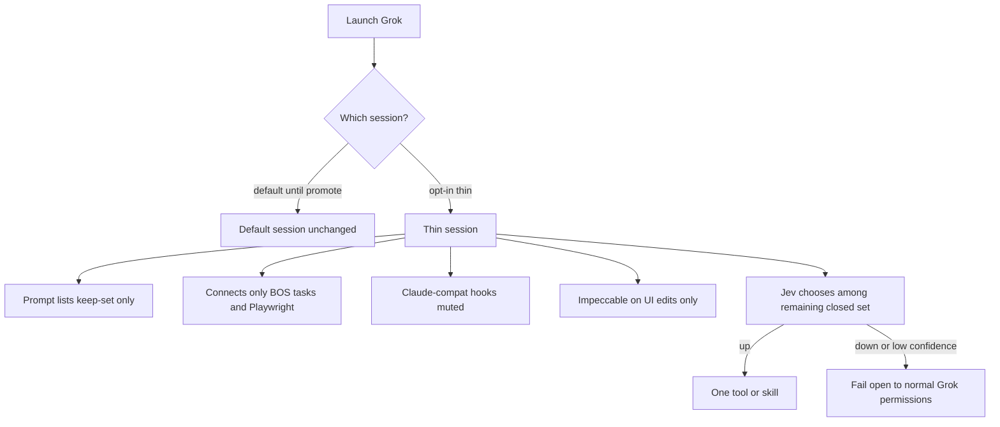
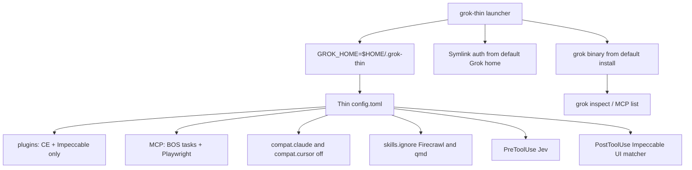

# Grok tempo thin session - Plan

**Target repo:** `blueprint-claude-kit`. Machine-side files live under `$HOME/.grok` (default) and `$HOME/.grok-thin` (trial). Do not put those home paths in other sections as repo files.

## Goal Capsule

- **Objective:** On Jay's machine, a coding turn in the thin Grok session starts with a thinner prompt and takes fewer wrong-tool detours, while Compound Engineering, Impeccable, and the kit issue loop still work.
- **Means:** Opt-in second Grok home plus launcher, Grok-native Impeccable UI-edit hook, Jev PreToolUse fail-open hook, then promote/apply docs (KTD1, KTD2, KTD3).
- **Product authority:** This Product Contract. Surrounding kit re-founding and factory leftover Jev are not active scope.
- **Product Contract preservation:** unchanged.
- **Execution profile:** Smoke-first. Prove a live thin session before promote docs.
- **Stop conditions:** Stop if a second Grok home cannot start without rewriting `$HOME/.grok/config.toml`. Stop if Jev can grant a capability Grok would have denied. Stop if Jev blocks a call Grok would have allowed, except an intentional closed-set deny of `none` or an off-catalog name.
- **Open blockers:** None.
- **Tail ownership:** Kit scripts and docs in this repo. Operator apply copies templates into `$HOME/.grok-thin`. `setup.sh` is not changed in this pass.

---

## Product Contract

### Summary

Jay gets an opt-in thin Grok session whose keep-set is Compound Engineering, Impeccable, Jev, kit workflows, BlueprintOS tasks, and Playwright.
Dead catalog is invisible and disconnected in that session.
A Jev hook sits outside the model on the remaining closed set.
Default Grok stays until he promotes the thin session.

### Problem Frame

The July baseline already set the plugin keep-set to Compound Engineering and Impeccable, and it removed the qmd MCP server on measured use.
The live Grok session still loads Cloudflare and Sentry plugins, a duplicate Compound Engineering install, Firecrawl skills via agent-skill discovery, Claude-compat hooks (including a 120-second worktree setup and an Impeccable Stop pass), and MCP surfaces the baseline never kept, including Cursor's hundreds of tools.
qmd is unused.
That extra surface lengthens every prompt and sends the model on tool detours.
Boyd's aim here is organized speed: a thinner Observe, a cleaner Decide, not a bigger toolbox.
Yesterday's kit re-founding plan left developer-machine hygiene as surrounding work.
Factory leftover Jev already proved a closed-set Choice with a confidence floor; it explicitly left harness routing out.

<!-- ce-section: work-relationships -->
### How This Work Fits Together

This plan owns Jay's Grok tempo trial: the thin session, the keep-set, the Jev hook, and a later apply option.
The breakdown below is current understanding, not a committed roadmap.

- Kit re-founding (rename, dual-harness packaging, onboarding) at `docs/plans/2026-09-19-1725-refactor-code-kit-dual-harness-onboarding-plan.md`
  - Can proceed independently of this trial.
  - Shares the two-plugin keep-set recorded in `docs/claude-setup-baseline.md`.
  - Still to decide after this trial: whether the kit should ship the thin-session profile as the apply path for other developers.
- Factory leftover Jev residual
  - Can proceed independently.
  - Shares Jev as a closed-set Choice with fail-open.
  - Does not include harness routing; this plan does.

### Key Decisions

- **Opt-in thin session, then promote.** (session-settled: user-directed — chosen over replacing default Grok now and over hide-only visibility: a kink must not take down the session already in use.) Governs R5, R16, R17.
- **Cut dead catalog and add a Jev hook.** (session-settled: user-directed — chosen over cut-only and over an on-demand Jev skill/MCP: thinner prompt plus fewer detours.) Governs R6, R7, R12, R15.
- **Plugins keep-set is CE and Impeccable; Jev is the PreToolUse hook; kit workflows stay.** (session-settled: user-directed — chosen over cutting the kit issue loop and over a measured-hits-only keep-set: the kit loop is the org workflow, not extra install weight.) Governs R1, R2, R3, R11, R15.
- **qmd is out.** (session-settled: user-directed — chosen over maybe-keep: unused in real turns.) Governs R4.
- **Trial on Jay's machine; team apply is an option after kinks.** (session-settled: user-directed — chosen over fleet default on day one: wring inefficiencies on one machine first.) Governs R18.
- **MCP keep is BlueprintOS tasks and Playwright.** (session-settled: user-directed — chosen over no MCP and over Cursor, GitNexus, Zapier, and analytics.) Governs R8.
- **Mute Claude-compat hooks on Grok; Impeccable on UI edits only.** (session-settled: user-approved — chosen over leaving all hooks, muting everything except Jev, and keeping the Stop design pass: Stop-every-turn fights tempo; UI-edit checks still earn Impeccable's keep.) Governs R9, R10.
- **Jev fail-open and never grants.** Fail-open preserves tempo when Jev is down; permission still belongs to Grok. Governs R13, R14.

### Actors

- A1. **Jay** — runs the trial on his machine; decides when to promote and whether to offer apply.
- A2. **Thin Grok session** — the opt-in session that must be thin on every turn.
- A3. **Default Grok session** — unchanged until promotion.
- A4. **Jev hook** — closed-set chooser outside the model.
- A5. **Other Blueprint developers** — may apply the same profile after the trial; not the primary actor of this pass.



### Requirements

**Keep-set**

- R1. Compound Engineering and Impeccable remain available in the thin session.
- R2. Kit issue-loop workflows remain available in the thin session.
- R3. Jev is the only added judgment layer in the thin session, and it runs outside the model.
- R4. The thin session does not load, advertise, or connect qmd.

**What the thin session can see and connect**

- R5. Jay can start the thin session without changing the default session.
- R6. The thin session prompt does not include cut skills, cut plugins, or cut MCP catalogs.
- R7. The thin session does not connect cut MCP servers, including Cursor, GitNexus, Zapier, analytics, Cloudflare, GitHub, and Sentry.
- R8. The only MCP servers the thin session connects are BlueprintOS tasks and Playwright.
- R9. Claude-compat hooks do not run in the thin session, including prompt-inject, SessionStart worktree setup, SessionEnd capture, and Impeccable Stop. Impeccable UI-edit is R10 via a Grok-native hook.
- R10. Impeccable may run on UI file edits in the thin session. Stop behavior is R9.
- R11. Third-party plugins other than Compound Engineering and Impeccable are not enabled in the thin session, including Cloudflare, Sentry, Chrome DevTools, browser-use, and the Firecrawl skill pack.

**Jev hook**

- R12. On state-changing tool calls and MCP `use_tool`, Jev chooses among the live remaining catalog names plus `none`. Reads are not gated.
- R13. If Jev is unreachable, slow, or low-confidence, the step proceeds under normal Grok permissions.
- R14. A Jev allow never grants a capability Grok would have denied.
- R15. Jev is not present in the thin session as a prompt-resident skill or MCP tool.

**Trial, promote, apply**

- R16. Until Jay promotes, the default session stays usable and is not rewritten by the trial.
- R17. After the trial works, Jay can make the thin session the default on this machine.
- R18. After promotion, other developers can apply the same profile without reconstructing it from this conversation.

### Key Flows

- F1. Start the trial
  - **Trigger:** Jay wants a thin coding turn.
  - **Actors:** A1, A2, A3
  - **Steps:** Jay launches the thin session. Default Grok remains available. The thin session loads the keep-set only.
  - **Outcome:** A usable thin turn without rewriting default. **Covers R5, R16.**
- F2. Observe and decide in the thin session
  - **Trigger:** Jay submits a coding prompt in the thin session.
  - **Actors:** A1, A2, A4
  - **Steps:** Prompt contains keep-set surface only. Cut MCP does not connect. Claude-compat hooks do not run (per R9). On a state-changing tool or MCP `use_tool` pick, Jev chooses among the remaining closed set, or fails open (per R12).
  - **Outcome:** Thinner prompt, fewer catalog detours. **Covers R6, R7, R8, R9, R12, R13.**
- F3. UI edit with Impeccable
  - **Trigger:** The thin session edits a UI file.
  - **Actors:** A2
  - **Steps:** Impeccable may check the edit. Ending the turn does not run a design deep pass.
  - **Outcome:** Impeccable still earns its keep on UI work without Stop-every-turn cost. **Covers R10.**
- F4. Promote and optional apply
  - **Trigger:** Jay judges the trial successful.
  - **Actors:** A1, A3, A5
  - **Steps:** Jay promotes the thin session to default on this machine. The same profile can later be applied by other developers.
  - **Outcome:** Tempo becomes the path he types into, with a fleet option that is not this pass's default. **Covers R17, R18.**

### Acceptance Examples

- AE1. Cursor stays dark
  - **Covers R7, R6.**
  - **Given:** Cursor MCP is still installed somewhere on the machine.
  - **When:** Jay starts the thin session.
  - **Then:** That session does not connect Cursor and does not list Cursor's tools in the prompt.
- AE2. Default survives the trial
  - **Covers R5, R16.**
  - **Given:** The thin session exists.
  - **When:** Jay launches default Grok.
  - **Then:** Default still starts and is not the thin keep-set until he promotes.
- AE3. qmd is gone from the thin turn
  - **Covers R4.**
  - **Given:** qmd CLI may still be on the machine.
  - **When:** Jay works in the thin session.
  - **Then:** qmd is not in the prompt, not an MCP server, and not a mandated first search.
- AE4. Jev down does not stall the turn
  - **Covers R13.**
  - **Given:** Jev is unreachable.
  - **When:** The thin session is about to call a remaining tool.
  - **Then:** The call is not blocked by Jev, and Grok's own permissions still apply.
- AE5. Stop is not a design pass
  - **Covers R9, R10.**
  - **Given:** The thin session just finished a non-UI coding turn.
  - **When:** The turn stops.
  - **Then:** No Impeccable Stop design pass and no Claude-compat prompt-inject or worktree-setup hook ran.
- AE6. UI edit may still be checked
  - **Covers R10, R1.**
  - **Given:** The thin session edits a UI file.
  - **When:** The edit lands.
  - **Then:** Impeccable may run on that edit; Compound Engineering remains available.

### Success Criteria

- S1. In the thin session, Jay can see a shorter skill and integration surface than today's default Grok turn (thinner prompt).
- S2. In the thin session, the model does not open cut MCP catalogs or unused skill packs as a first move (fewer tool detours).
- S3. A normal coding turn in the thin session can complete Compound Engineering and kit workflows without needing the cut catalog.
- S4. Promotion is a deliberate Jay action, not an implicit side effect of creating the trial.

### Scope Boundaries

**Deferred for later**

- Rolling the thin session to every Blueprint machine as the default.
- Packaging the profile into the kit re-founding install path.
- Uninstalling unused binaries from disk, as opposed to making them invisible and disconnected in the thin session.
- Replacing Playwright with host-native browser only.

**Outside this product's identity**

- Removing Compound Engineering or Impeccable.
- Cutting kit issue-loop workflows.
- Factory leftover bounce classify, Issues-readiness Jev, or a prompt-resident Jev skill/MCP.
- Kit rename and dual-harness onboarding.

**Deferred to Follow-Up Work**

- Teaching qmd out of `ONBOARDING.md` and `setup.sh`.
- Deduplicating Compound Engineering and Sentry plugin clones in the default Grok store.
- Adding a Grok section to `docs/claude-setup-baseline.md` beyond a pointer to the thin-session trial doc.

### Dependencies / Assumptions

- Isolation is KTD1. The prior assumption that Grok can isolate a session is now a named mechanism.
- Jev remains callable with the existing org key pattern. Missing or failed Jev fail-opens per R13.
- Playwright in the keep-set is an accepted extra browser stack against Compound Engineering's host-native-browser rule.
- Duplicate plugin installs and Firecrawl-under-agent-skills are cut-catalog problems for the thin session, not a mandate to delete every copy on disk in this pass.

### Outstanding Questions

None blocking. Implementation-time items live in Planning Contract.

### Sources / Research

- Kit plugin baseline: `docs/claude-setup-baseline.md` (two plugins; qmd MCP already removed).
- Kit re-founding, deferred machine hygiene: `docs/plans/2026-09-19-1725-refactor-code-kit-dual-harness-onboarding-plan.md`.
- Factory leftover Jev, harness routing excluded: BlueprintOS leftover-jev-residual unified plan.
- Grok MCP is reached through `search_tool` / `use_tool`; Claude and Cursor hooks merge unless compat is muted (Grok user guide, Hooks and MCP chapters).
- Live default Grok (verified 2026-09-20): Cloudflare and Sentry enabled beside Compound Engineering; duplicate Compound Engineering installs; Firecrawl skills present under agent-skills despite Claude `skillOverrides` off; no Grok-native hooks directory; Claude UserPromptSubmit inject-rules and BlueprintOS SessionStart / Impeccable Stop hooks still merge in.
- `GROK_CONFIG` overlay cannot set plugins or MCP. Compat has process env (`GROK_CLAUDE_HOOKS_ENABLED`, `GROK_CURSOR_MCPS_ENABLED`, and siblings). Plugin enablement lives in `$GROK_HOME/config.toml`.
- `scripts/apply-baseline-plugins.sh` mutates Claude `enabledPlugins` only. It does not thin Grok.
- TypeSafe System One: code owns control flow; Choice over a closed set; ~100 ms; confidence gates; fail-open is a code policy, not a model grant.

---

## Planning Contract

### Key Technical Decisions

- KTD1. **Thin session is a second Grok home launched by a wrapper.** (session-settled: user-approved — chosen over env-only on the default home and over rewriting default `config.toml`: overlay and Claude-compat env cannot disable Grok plugins without touching the default home.) Instantiates R5, R16. Cite Grok config reference `GROK_HOME` and the overlay allowlist.
- KTD2. **Claude-compat is fully off in the thin home. Impeccable UI-edit is a Grok-native hook there.** Instantiates R9, R10. Claude Stop and UI-edit both arrive through the same compat merge; a selective Claude mute is not available.
- KTD3. **Jev is a PreToolUse command hook in the thin home.** Instantiates R3, R12, R13, R14, R15. Matcher covers state-changing tools plus MCP `use_tool`. Choice over remaining names plus `none`. Confidence floor starts at 0.7 to match leftover Jev. Deny never upgrades Grok permissions. Unreachable, timeout, or low confidence fail open.
- KTD4. **Closed set is whatever the thin session actually exposes after U1.** Native tools, kit and CE and Impeccable skills, BlueprintOS tasks, Playwright. The hook reads the live catalog rather than a stale hardcoded list.
- KTD5. **Team apply is copy-the-templates, not `setup.sh`.** Instantiates R18. Matches RTK one-dev trial shape in `docs/rtk-trial-protocol.md`.

### High-Level Technical Design



Default `grok` keeps `$HOME/.grok`. Promotion copies thin `config.toml` and hooks onto the default home after a timestamped backup, then Jay launches plain `grok`.

### Assumptions

- Symlinking `auth.json` (and lock) from the default home into the thin home is enough to stay signed in.
- `grok inspect` from a process with `GROK_HOME` set reports that home's plugins, MCP, skills, and hook sources.
- Kit issue-loop skills are wired with `[skills] paths` in the thin config (U1). They are not assumed to survive Claude skill-scan mute on their own.
- Jev key stays in the existing org secret file pattern already used by leftover bounce.

### Implementation Notes

- Backup before any JSON or TOML mutate, timestamped suffix, re-validate parse, print delta. Mirror `scripts/apply-baseline-plugins.sh`.
- macOS bash 3.x: no associative arrays in the launcher.
- Launcher is one physical line in docs the user will paste, or a single script path.
- Never commit MCP headers or Jev keys. Templates use env placeholders.
- Fail-open for Jev matches `docs/extension-points.md` fail-open on bad config.

### Sequencing

U1 (home + launcher) then U2 (Impeccable hook) and U3 (Jev hook) in parallel, then U4 (smoke), then U5 (promote/apply docs).

---

## Output Structure

```text
scripts/
  grok-thin.sh
  grok-thin-home/
    config.toml.tmpl
    hooks/
      jev-pretool.sh
      impeccable-ui-edit.sh
  test-grok-thin.sh
docs/
  grok-tempo-thin-session.md
```

The tree is a scope declaration. Per-unit Files lists stay authoritative.

---

## Implementation Units

### U1. Thin Grok home and launcher

- **Goal:** Jay can start a thin Grok process that does not rewrite the default home.
- **Requirements:** R1, R2, R4, R5, R6, R7, R8, R11, R16
- **Dependencies:** none
- **Files:** `scripts/grok-thin.sh`, `scripts/grok-thin-home/config.toml.tmpl`, `scripts/test-grok-thin.sh`
- **Approach:**
  1. Create `$HOME/.grok-thin` on first run if missing. Copy from templates. Symlink auth from `$HOME/.grok`. Do not copy default `config.toml`.
  2. Make Compound Engineering load: symlink or copy `$HOME/.grok/installed-plugins` and its registry into the thin home, or set `plugins.paths` at the existing CE install. `plugins.enabled` alone is not enough.
  3. Make Impeccable load without Claude-compat: Grok-install Impeccable into the thin home, or set `plugins.paths` / `skills.paths` at a known Impeccable tree. It is not in the current Grok plugin registry.
  4. Set `[skills] paths` at the kit skill tree so `start-work` / `finish-work` survive `compat.claude.skills = false`. Thin inspect must list those names.
  5. Thin `config.toml` enables Compound Engineering and Impeccable only. MCP blocks: BlueprintOS tasks and Playwright. `compat.claude` and `compat.cursor` all false. `skills.ignore` covers Firecrawl agent-skill trees and any qmd skill path. No qmd MCP block.
  6. Copy hook scripts into `$GROK_HOME/hooks/` and register them with paths that Grok will actually run (JSON colocated relative commands, or launcher-rewritten absolute paths in TOML).
  7. Launcher sets `GROK_HOME` to the thin home and execs the same `grok` binary the default install uses.
  8. Default `grok` with unset `GROK_HOME` still uses `$HOME/.grok`.
- **Execution note:** This is packaging and config. Prefer install/runtime smoke over unit coverage.
- **Patterns to follow:** `scripts/apply-baseline-plugins.sh` backup and validate. `docs/rtk-trial-protocol.md` one-dev opt-in.
- **Test scenarios:**
  - Covers AE2. After install, default `grok` still starts against `$HOME/.grok` and still lists Cloudflare or Cursor if they were there before.
  - Covers AE1. Thin launch `grok inspect` (or MCP list) does not show Cursor, GitNexus, Zapier, analytics, Cloudflare MCP, GitHub MCP, or Sentry MCP.
  - Covers AE3. Thin inspect does not list qmd as MCP or mandated skill.
  - Thin inspect lists Compound Engineering, Impeccable, kit `start-work` or `finish-work`, BlueprintOS tasks, and Playwright.
  - Launcher is idempotent: second run does not clobber a hand-edited thin config without backup.
- **Verification:** Default home `config.toml` mtime and plugin list unchanged. Thin inspect matches the keep-set.

### U2. Grok-native Impeccable UI-edit hook

- **Goal:** UI file edits in the thin session can still run Impeccable. Stop does not run a design pass.
- **Requirements:** R1, R9, R10
- **Dependencies:** U1
- **Files:** `scripts/grok-thin-home/hooks/impeccable-ui-edit.sh`, matcher group in `scripts/grok-thin-home/config.toml.tmpl`
- **Approach:**
  1. PostToolUse matcher on edit/write tools, scoped to UI paths the Impeccable hook already understands.
  2. No Stop hook in the thin home.
  3. Claude-compat remains off (KTD2). Do not rely on BlueprintOS `.claude/settings.json` Stop or PostToolUse.
- **Execution note:** Smoke on one UI edit and one non-UI edit.
- **Patterns to follow:** BlueprintOS Impeccable hook command, 5s timeout, fail-open if the binary is missing.
- **Test scenarios:**
  - Covers AE6. Thin session edit of a `.svelte` or CSS file invokes the Impeccable UI hook.
  - Covers AE5. Thin session Stop after a PHP or Python edit does not invoke Impeccable and does not run worktree-setup or blume inject-rules.
  - Missing Impeccable binary: edit still succeeds.
- **Verification:** Hook logs or `grok inspect` hook list shows PostToolUse Impeccable only. No Stop handler.

### U3. Jev PreToolUse fail-open hook

- **Goal:** State-changing tool and MCP `use_tool` picks go through a closed-set Jev Choice. Jev cannot stall or extra-grant.
- **Requirements:** R3, R12, R13, R14, R15
- **Dependencies:** U1
- **Files:** `scripts/grok-thin-home/hooks/jev-pretool.sh`, PreToolUse group in `scripts/grok-thin-home/config.toml.tmpl`, `scripts/test-grok-thin.sh` (Jev cases)
- **Approach:**
  1. Command hook, not an MCP or skill (R15).
  2. SessionStart writes `$GROK_HOME/state/thin-catalog.json` from `grok inspect` (or equivalent). The PreToolUse hook reads that file. Missing, unreadable, or stale catalog fail-opens. Include `none`. Do not hardcode the name list in git.
  3. Choice plus confidence. At or above 0.7, allow only the selected remaining tool. Below 0.7, timeout, HTTP error, or missing key: allow.
  4. Never emit a permissionDecision that grants a tool Grok already denied.
  5. Key from the existing org file pattern. No key in git. Hook logs must not print the key, bearer tokens, or MCP headers.
- **Execution note:** Prove fail-open with the key unset before wiring a live key.
- **Patterns to follow:** Leftover Jev 0.7 floor and fail-open unclassified. TypeSafe: code owns the gate. Kit extension-points fail-open.
- **Test scenarios:**
  - Covers AE4. Key missing: a remaining tool call is allowed and Grok permissions still apply.
  - Jev timeout: same fail-open.
  - High-confidence Choice of a remaining tool: call proceeds.
  - High-confidence `none` or off-catalog name: deny with a reason the model can see, without granting a new capability.
  - Thin session skill list does not include a Jev or TypeSafe skill.
  - Missing or stale catalog file: remaining tool call is allowed.
- **Verification:** Fixture stdin JSON through the hook script, no network required for fail-open cases. One live Choice only after fail-open is green.

### U4. Live thin-session smoke

- **Goal:** Jay can see a thinner prompt and dark cut MCP in a real thin turn.
- **Requirements:** S1, S2, S3, AE1, AE2, AE3, AE5
- **Dependencies:** U1, U2, U3
- **Files:** `scripts/test-grok-thin.sh`, `docs/grok-tempo-thin-session.md` (smoke section)
- **Approach:**
  1. Script runs `GROK_HOME` inspect/MCP list and compares to an expected allowlist.
  2. Manual checklist: one CE flow (`ce-work` or kit `start-work` dry), one UI edit, one Stop.
  3. Capture a before/after skill and MCP count from default vs thin.
- **Execution note:** Runtime smoke is the proof. Do not treat `scripts/validate-kit.py` as sufficient.
- **Patterns to follow:** `docs/guides/README.md` `grok inspect` as oracle. RTK trial: work normally after install.
- **Test scenarios:**
  - Allowlist check fails if Cursor or Firecrawl appears.
  - Allowlist check fails if CE or Impeccable is missing.
  - Default vs thin counts: thin skill+MCP count is lower (S1).
- **Verification:** Script exit 0 on allowlist. Manual checklist ticked in the trial doc.

### U5. Promote and apply docs

- **Goal:** Promotion is a deliberate copy with backup. Other developers can apply the same templates later.
- **Requirements:** R17, R18, S4
- **Dependencies:** U4
- **Files:** `docs/grok-tempo-thin-session.md`, pointer sentence in `docs/claude-setup-baseline.md`
- **Approach:**
  1. Trial protocol: install, smoke, work for real turns, then decide.
  2. Promote: timestamped backup of `$HOME/.grok/config.toml` and hooks, then copy thin config and Grok-native hooks onto the default home. Claude settings are not the promote path.
  3. Apply-for-others: clone kit, run the same launcher. Not `setup.sh`.
  4. Rollback: restore the backup.
- **Execution note:** Documentation and a documented operator procedure. No fleet push.
- **Patterns to follow:** `docs/rtk-trial-protocol.md` one-dev, measure, optional adopt, rollback.
- **Test scenarios:**
  - Covers AE2 until promote. Promote instructions require an explicit command Jay runs.
  - Rollback restores prior plugin and MCP lists.
  - Apply doc names only kit templates and the launcher. It does not tell people to edit default Grok first.
- **Verification:** A cold reader can install thin, promote, and roll back from the doc without this chat.

---

## Verification Contract

- `scripts/test-grok-thin.sh` — allowlist inspect under `GROK_HOME` thin vs default; Jev hook fail-open fixtures.
- `scripts/validate-kit.py` — still green. New templates must not introduce `$ARGUMENTS` or Claude-only constructs.
- Manual: one thin coding turn that uses Compound Engineering or kit `start-work` without cut MCP.
- Manual: UI edit triggers Impeccable; non-UI Stop does not.
- Oracle: `grok inspect` with each `GROK_HOME`. Trust `grok inspect` over `/context` for Grok.

## Definition of Done

- Default Grok home is unchanged until Jay runs promote.
- Thin session keep-set matches R1, R2, R8, R11.
- Cut MCP and Firecrawl/qmd are absent from thin inspect.
- Jev hook fail-open fixtures pass. Live deny cannot grant.
- Trial doc covers install, smoke, promote, rollback, and later apply.
- `setup.sh` still does not install the thin home as fleet default.

---

## System-Wide Impact

Thin Grok no longer reads Claude or Cursor MCP, hooks, or skills. Project `.claude/settings.json` hooks (worktree-setup, Impeccable Stop) do not fire in the thin session. Claude Code itself is unchanged. Playwright MCP still starts in thin. Auth is shared via symlink, so a logout in either home can affect the other.

---

## Risks & Dependencies

- Auth symlink couples login state. If Grok refuses a symlink, copy auth instead and document that two homes can drift.
- Folder trust may not follow `GROK_HOME`. If the thin home starts untrusted, project instructions stay dark until trusted.
- BlueprintOS tasks still need a non-committed secret in the thin home (env placeholder or credentials symlink).
- Jev adds ~100 ms per gated tool. Scope the matcher to state-changing tools and `use_tool`, not every Read.
- Playwright keep contradicts `docs/claude-setup-baseline.md` and the canonical skill map. Do not "fix" by cutting Playwright. Record the override in the trial doc.
- Jev key file missing is a quiet fail-open. That is required (R13), not a miss.

---

## Documentation / Operational Notes

- New `docs/grok-tempo-thin-session.md` is the operator guide.
- One pointer from `docs/claude-setup-baseline.md`. Do not rewrite the Claude plugin table in this pass.
- Launcher invocation documented as a single line: `bash <kit>/scripts/grok-thin.sh`
