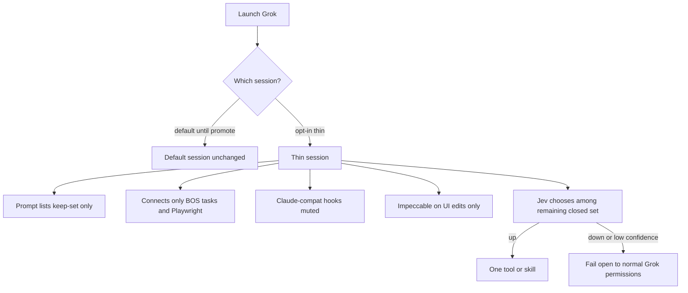

# Grok tempo thin session - Plan

## Goal Capsule

- **Objective:** On Jay's machine, a coding turn in the thin Grok session starts with a thinner prompt and takes fewer wrong-tool detours, while Compound Engineering, Impeccable, and the kit issue loop still work.
- **Means:** An opt-in thin session. That session cannot see or connect dead plugins, skills, MCP, or Claude-compat hooks. A Jev hook chooses among the remaining closed set. After the trial works, the same profile can become default and can be offered to other developers.
- **Product authority:** This Product Contract. Surrounding kit re-founding and factory leftover Jev are not active scope.
- **Open blockers:** None.

---

## Product Contract

### Summary

Jay gets an opt-in thin Grok session whose keep-set is Compound Engineering, Impeccable, Jev, kit workflows, BlueprintOS tasks, and Playwright.
Dead catalog is invisible and disconnected in that session.
A Jev hook sits outside the model on the remaining closed set.
Default Grok stays until he promotes the thin session.

### Problem Frame

The July baseline already set the plugin keep-set to Compound Engineering and Impeccable, and it removed the qmd MCP server on measured use.
The live Grok session still loads Cloudflare and Sentry plugins, a duplicate Compound Engineering install, Firecrawl skills via agent-skill discovery, Claude-compat hooks (including a 120-second worktree setup and an Impeccable Stop pass), and MCP surfaces the baseline never kept, including Cursor's hundreds of tools.
qmd is unused.
That extra surface lengthens every prompt and sends the model on tool detours.
Boyd's aim here is organized speed: a thinner Observe, a cleaner Decide, not a bigger toolbox.
Yesterday's kit re-founding plan left developer-machine hygiene as surrounding work.
Factory leftover Jev already proved a closed-set Choice with a confidence floor; it explicitly left harness routing out.

<!-- ce-section: work-relationships -->
### How This Work Fits Together

This plan owns Jay's Grok tempo trial: the thin session, the keep-set, the Jev hook, and a later apply option.
The breakdown below is current understanding, not a committed roadmap.

- Kit re-founding (rename, dual-harness packaging, onboarding) at `docs/plans/2026-09-19-1725-refactor-code-kit-dual-harness-onboarding-plan.md`
  - Can proceed independently of this trial.
  - Shares the two-plugin keep-set recorded in `docs/claude-setup-baseline.md`.
  - Still to decide after this trial: whether the kit should ship the thin-session profile as the apply path for other developers.
- Factory leftover Jev residual
  - Can proceed independently.
  - Shares Jev as a closed-set Choice with fail-open.
  - Does not include harness routing; this plan does.

### Key Decisions

- **Opt-in thin session, then promote.** (session-settled: user-directed — chosen over replacing default Grok now and over hide-only visibility: a kink must not take down the session already in use.) Governs R5, R16, R17.
- **Cut dead catalog and add a Jev hook.** (session-settled: user-directed — chosen over cut-only and over an on-demand Jev skill/MCP: thinner prompt plus fewer detours.) Governs R6, R7, R12, R15.
- **Plugins/tools keep-set is CE, Impeccable, and Jev; kit workflows stay.** (session-settled: user-directed — chosen over cutting the kit issue loop and over a measured-hits-only keep-set: the kit loop is the org workflow, not extra install weight.) Governs R1, R2, R3, R11.
- **qmd is out.** (session-settled: user-directed — chosen over maybe-keep: unused in real turns.) Governs R4.
- **Trial on Jay's machine; team apply is an option after kinks.** (session-settled: user-directed — chosen over fleet default on day one: wring inefficiencies on one machine first.) Governs R18.
- **MCP keep is BlueprintOS tasks and Playwright.** (session-settled: user-directed — chosen over no MCP and over Cursor, GitNexus, Zapier, and analytics.) Governs R8.
- **Mute Claude-compat hooks on Grok; Impeccable on UI edits only.** (session-settled: user-approved — chosen over leaving all hooks, muting everything except Jev, and keeping the Stop design pass: Stop-every-turn fights tempo; UI-edit checks still earn Impeccable's keep.) Governs R9, R10.
- **Jev fail-open and never grants.** Fail-open preserves tempo when Jev is down; permission still belongs to Grok. Governs R13, R14.

### Actors

- A1. **Jay** — runs the trial on his machine; decides when to promote and whether to offer apply.
- A2. **Thin Grok session** — the opt-in session that must be thin on every turn.
- A3. **Default Grok session** — unchanged until promotion.
- A4. **Jev hook** — closed-set chooser outside the model.
- A5. **Other Blueprint developers** — may apply the same profile after the trial; not the primary actor of this pass.

### Requirements

**Keep-set**

- R1. Compound Engineering and Impeccable remain available in the thin session.
- R2. Kit issue-loop workflows remain available in the thin session.
- R3. Jev is the only added judgment layer in the thin session, and it runs outside the model.
- R4. The thin session does not load, advertise, or connect qmd.

**What the thin session can see and connect**

- R5. Jay can start the thin session without changing the default session.
- R6. The thin session prompt does not include cut skills, cut plugins, or cut MCP catalogs.
- R7. The thin session does not connect cut MCP servers, including Cursor, GitNexus, Zapier, analytics, Cloudflare, GitHub, and Sentry.
- R8. The only MCP servers the thin session connects are BlueprintOS tasks and Playwright.
- R9. Claude-compat hooks other than Impeccable's UI-edit check do not run in the thin session, including prompt-inject, SessionStart worktree setup, SessionEnd capture, and Impeccable Stop.
- R10. Impeccable may run on UI file edits in the thin session. Stop behavior is R9.
- R11. Third-party plugins other than Compound Engineering and Impeccable are not enabled in the thin session, including Cloudflare, Sentry, Chrome DevTools, browser-use, and the Firecrawl skill pack.

**Jev hook**

- R12. Before the model wanders the remaining catalog, Jev chooses among the actual remaining tools and skills.
- R13. If Jev is unreachable, slow, or low-confidence, the step proceeds under normal Grok permissions.
- R14. A Jev allow never grants a capability Grok would have denied.
- R15. Jev is not present in the thin session as a prompt-resident skill or MCP tool.

**Trial, promote, apply**

- R16. Until Jay promotes, the default session stays usable and is not rewritten by the trial.
- R17. After the trial works, Jay can make the thin session the default on this machine.
- R18. After promotion, other developers can apply the same profile without reconstructing it from this conversation.

### Key Flows

- F1. Start the trial
  - **Trigger:** Jay wants a thin coding turn.
  - **Actors:** A1, A2, A3
  - **Steps:** Jay launches the thin session. Default Grok remains available. The thin session loads the keep-set only.
  - **Outcome:** A usable thin turn without rewriting default. **Covers R5, R16.**
- F2. Observe and decide in the thin session
  - **Trigger:** Jay submits a coding prompt in the thin session.
  - **Actors:** A1, A2, A4
  - **Steps:** Prompt contains keep-set surface only. Cut MCP does not connect. Claude-compat hooks other than Impeccable's UI-edit check do not run (per R9). On a tool or skill pick, Jev chooses among the remaining closed set, or fails open.
  - **Outcome:** Thinner prompt, fewer catalog detours. **Covers R6, R7, R8, R9, R12, R13.**
- F3. UI edit with Impeccable
  - **Trigger:** The thin session edits a UI file.
  - **Actors:** A2
  - **Steps:** Impeccable may check the edit. Ending the turn does not run a design deep pass.
  - **Outcome:** Impeccable still earns its keep on UI work without Stop-every-turn cost. **Covers R10.**
- F4. Promote and optional apply
  - **Trigger:** Jay judges the trial successful.
  - **Actors:** A1, A3, A5
  - **Steps:** Jay promotes the thin session to default on this machine. The same profile can later be applied by other developers.
  - **Outcome:** Tempo becomes the path he types into, with a fleet option that is not this pass's default. **Covers R17, R18.**

### Acceptance Examples

- AE1. Cursor stays dark
  - **Covers R7, R6.**
  - **Given:** Cursor MCP is still installed somewhere on the machine.
  - **When:** Jay starts the thin session.
  - **Then:** That session does not connect Cursor and does not list Cursor's tools in the prompt.
- AE2. Default survives the trial
  - **Covers R5, R16.**
  - **Given:** The thin session exists.
  - **When:** Jay launches default Grok.
  - **Then:** Default still starts and is not the thin keep-set until he promotes.
- AE3. qmd is gone from the thin turn
  - **Covers R4.**
  - **Given:** qmd CLI may still be on the machine.
  - **When:** Jay works in the thin session.
  - **Then:** qmd is not in the prompt, not an MCP server, and not a mandated first search.
- AE4. Jev down does not stall the turn
  - **Covers R13, R14.**
  - **Given:** Jev is unreachable.
  - **When:** The thin session is about to call a remaining tool.
  - **Then:** The call is not blocked by Jev, and Grok's own permissions still apply.
- AE5. Stop is not a design pass
  - **Covers R9, R10.**
  - **Given:** The thin session just finished a non-UI coding turn.
  - **When:** The turn stops.
  - **Then:** No Impeccable Stop design pass and no Claude-compat prompt-inject or worktree-setup hook ran.
- AE6. UI edit may still be checked
  - **Covers R10, R1.**
  - **Given:** The thin session edits a UI file.
  - **When:** The edit lands.
  - **Then:** Impeccable may run on that edit; Compound Engineering remains available.

### Success Criteria

- S1. In the thin session, Jay can see a shorter skill and integration surface than today's default Grok turn (thinner prompt).
- S2. In the thin session, the model does not open cut MCP catalogs or unused skill packs as a first move (fewer tool detours).
- S3. A normal coding turn in the thin session can complete Compound Engineering and kit workflows without needing the cut catalog.
- S4. Promotion is a deliberate Jay action, not an implicit side effect of creating the trial.

### Scope Boundaries

**Deferred for later**

- Rolling the thin session to every Blueprint machine as the default.
- Packaging the profile into the kit re-founding install path.
- Uninstalling unused binaries from disk, as opposed to making them invisible and disconnected in the thin session.
- Replacing Playwright with host-native browser only.

**Outside this product's identity**

- Removing Compound Engineering or Impeccable.
- Cutting kit issue-loop workflows.
- Factory leftover bounce classify, Issues-readiness Jev, or a prompt-resident Jev skill/MCP.
- Kit rename and dual-harness onboarding.

### Dependencies / Assumptions

- Grok can isolate an opt-in session so default remains until promotion. Planning names the isolation mechanism.
- Jev remains callable with the existing org key pattern. Missing or failed Jev fail-opens per R13.
- Playwright in the keep-set is an accepted extra browser stack against Compound Engineering's host-native-browser rule.
- Duplicate plugin installs and Firecrawl-under-agent-skills are cut-catalog problems for the thin session, not a mandate to delete every copy on disk in this pass.

### Outstanding Questions

- **Deferred to Planning:** How Grok isolates the thin session from default (profile, agent definition, or config overlay).
- **Deferred to Planning:** Which remaining tool and skill names form Jev's closed set, and what confidence floor matches leftover Jev without copying that job.
- **Deferred to Planning:** Exact Grok compat switches that mute Claude hooks and extra skill roots without disabling Impeccable's UI-edit hook.

### Sources / Research

- Kit plugin baseline: `docs/claude-setup-baseline.md` (two plugins; qmd MCP already removed).
- Kit re-founding, deferred machine hygiene: `docs/plans/2026-09-19-1725-refactor-code-kit-dual-harness-onboarding-plan.md`.
- Factory leftover Jev, harness routing excluded: BlueprintOS leftover-jev-residual unified plan.
- Grok MCP is reached through `search_tool` / `use_tool`; Claude and Cursor hooks merge unless compat is muted (Grok user guide, Hooks and MCP chapters).
- Live default Grok (verified 2026-09-20): Cloudflare and Sentry enabled beside Compound Engineering; duplicate Compound Engineering installs; Firecrawl skills present under agent-skills despite Claude `skillOverrides` off; no Grok-native hooks directory; Claude UserPromptSubmit inject-rules and BlueprintOS SessionStart / Impeccable Stop hooks still merge in.
